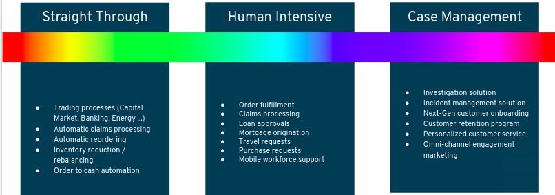

# Implementing Business Solutions using the Power of Enterprise Open Source

Red Hat, as the leading provider of an integrated, hybrid-cloud, enterprise software stack, needed to showcase its unified portfolio to its Public Sector customers.  To do so, it created a demonstration of a business solution that can serve as an enabler of humanity at its best:  voluntary collaboration between neighbors of a community during a disaster.  Specifically, this business solution, called [the Emergency Response demonstration](https://erdemo.io), is themed after the [Cajun Navy response to Hurricane Harvey](https://en.wikipedia.org/wiki/Cajun_Navy) in 2017.  The Cajun Navy first responders of Hurricane Harvey embodied the Power of Communities.

This blog post is part of a larger series of [webinars](https://www.brighttalk.com/webcast/16623/398059) and [articles]() that discuss the Power of Communities and how it can be impactful to your lines of business.

One challenge that you might still have is identifying those business use cases in your own organization that could also benefit from the power of enterprise open-source innovation in a manner similar to what you have observed with Red Hat's Emergency Response demo application.  In this article, I want to continue to explore categories of the *Solution Spectrum* and a sampling of business use-cases with the hope of highlighting patterns you can use.

# Solution Spectrum
From a birds-eye perspective, business processes often fall into one or more categories of the following solution spectrum:

**Straight Through** business processes can often times be fully automated.  These business processes are well defined and the business owner can graphically model its flow along with any business exception handling.  A single department in your organization might have many business processes and its often the case that these business processes have dependencies and interact with each other.  Using that same graphical model that the business owner created, business process **instances** are spawn.  These business process instances are typically triggered from some other business application in the form of an event.

Recall from the Emergency Response demo application that the life-cycle of each *incident* is fully managed by a corresponding business process instance.  These instances execute as per the graphical business process definition which was previously defined in close collaboration with the *incident commander*.  When an Emergency Response incident is created, the corresponding business process orchestrates the interactions between all of the other services of the business solution in an *event-driven* manner.

The business process may include one or more *wait states* where its best to place that business process instance in a sleep mode until some other external business application triggers another event to re-awaken it and continue to the next defined task.  Recall from the Emergency Response demo that its business process included 4 of these *wait-states*.  The life of a straight through business process might last anywhere from a few seconds to a few hours.  The volume of business process instances that your business may need to execute on for a specific business process will vary greatly from just a couple a day to extreme scenarios of tens of thousands per second.  In all cases, your lines of business will greatly benefit from the modeling of your business processes and executing those same business processes in a consistent manner.

Historically, the tools used to model and execute *straight through* business processes have been prohibitively expensive (from both a monetary price as well as IT requirements perspective) to consider for all but the most critical use cases in larger enterprise organizations.  This is no longer the case.  Industry standardization along with the power of open source innovation now makes the automation of *straight through* business processes feasible to virtually all organizations globally. 

**Human Intensive** business processes share many of the same characteristics of *straight through* business processes.  However, as the name suggests, *human intensive* business processes involve humans and often can not be fully automated.  The *wait states* seen in *straight through* business processes are periods of time where the *knowledge workers* of your organization are executing tasks and adding value to the business process.

Assignment of knowledge workers to a specific business process instance can occur in a variety of ways.  The assignment can be specific to a group of knowledge workers.  Once one of the knowledge workers in the group is available, they can *claim* the next task of a business process to work on.  If the knowledge worker is unable to complete the task for whatever reason, then the task can be placed back on the queue for a different knowledge worker in the group to work on.  In some scenarios, assignment of knowledge workers to a task of a business process can be more complex.  It might be the case that business **rules** (also defined in collaboration with the business owner) need to execute so as to determine the assignment.  Semi-related is that often times its not initially apparent if a solution for a line of business is more process or rules oriented.  More often than not, the business solution is a mixture of both.  The tool that your IT department selects to implement your solution should offer both business process as well as business rule capabilities.

As a best practice, a human task should be set with a deadline for completion.  Remedial action for tasks that have not completed as per that deadline can vary.  It may be as simple as placing the task back on the queue but often times notifications / reminders should be sent out and the task should be *escalated* to a more senior member of the organization.

Being that your knowledge workers will be imputing value on your business processes during these human tasks, the user interfaces associated with these tasks should be intuitive and powerful enough to complete the task given the knowledge worker's role.  These user interfaces (often created by developers using any one of the many mature open-source UI frameworks on the market today), interact with the APIs exposed by the business process engine that manages your business processes.  On the topic of roles, these security roles and the assignment of your knowledge workers to those roles should already exist in your Identity Management solution.  Your IT department will know all the details.  It is critical that the business process and rules tooling used to implement your business solution integrates seamlessly with your organization's Identity Management solution.

**Case Management** builds off of the concepts discussed with *straight through* and *human intensive* business processes.  Case Management business processes, however, are more unpredictable, data-driven and unstructured.  To work on a case, your line of business may need to include knowledge workers, customers and various sets of case participants to collaborate in the decision-making.  Often, an ad hoc inclusion of knowledge workers is required as the processes experience unknown contents and events.  Hence, a solution is required to model the patterns of work which are complex, unpredictable, unstructured, unknown, and those which require a higher degree of collaboration, complex decision-making, dynamism, and so on.

An adoptive case is often modeled collaboratively between business owner and developer by specifying *milestones*.  Milestones are logical checkpoints in the case that represent the completion of a deliverable.  Milestones are used to trace the progress of that case.

Decisions made on a case by one or more knowledge workers in your organization are going to be made in the context of the files and data associated with that case.  Subsequently, integration with a Content Management System (where all of the files of a case reside) is often a requirement of case management.

# Use Cases Implemented using Enterprise Open Source Innovation

**Hospital employee scheduling and patient on-boarding**
The scheduling of nurses and doctors in all but the smallest of hospitals can be complex.  Doctors and nurses each have specialized skills and it is typically a requirement that all shifts in the hospital schedule be fully staffed.  To date, hospital scheduling is done manually in a spreadsheet.  Doing so burdens valuable hospital personnel with maintaining this schedule and produces a schedule that is almost guaranteed to be sub-optimal.  A sub-optimal schedule fails to maximize the potential of that highly talented workforce and introduces unnecessary stress and conflict.  Given the extreme challenges already being placed upon doctors and nurses in today's world, maximizing the effectiveness of hospital staff is of great importance.

Determining the best solution among a huge array of possible choices falls in the category known as *Applied Artifical Intelligence*.  Another term often used is *Constraint Solving*.  Given one of the many planning problems encountered in business, a constraint solver identifies the *best solution*.  This *best solution* is almost never apparent in a reasonable period of time when the planning problem is attempted by a human.

Identifying and applying the best employee schedule in a hospital where the demands increasingly change daily is one step in a series of longer running business processes.  These business processes exhibit characteristics identified in all three categories of the solution spectrum:   *Straight Through*, *Human Intensive* and *Case Management*.

A hospital employee scheduling tool along with the process and rules engines that power the hospital's end-to-end business processes should be reliable and compliant with government mandates.  This is all feasible today in a hybrid cloud environment that scales up or down to match the demands of the hospital using enterprise open source components.

**Case Management of unemployment benefit enrollments**
During these trying times, an unfortunately spike in enrollments for unemployment benefits has occurred in countries around the globe.  Legacy and manual systems used to handle the enrollment and issuance of unemployment benefits are not designed to accommodate these huge spikes.

Business use cases that are susceptible to huge spikes in demand require a solution that is event-driven.  Recall that the Emergency Response demo is event-driven.  Subsequently, the hardware resources used by components of the solution are freed to handle increased concurrent demand.

Cases pertaining to enrollment and issuance of unemployment benefits are defined by *milestones* that are executed on during collaboration of knowledge workers and citizens enrolling in the entitlement.  The data associated with these cases and milestones becomes immensely valuable for identifying if the business is meeting key performance indicators.  Recall that the Emergency Response demo aggregates and exposes data from incidents, missions and business process instances in the form of business dashboards that provide situational commander to the incident commander.  These business dashboards also provide visibility on opportunities to adjust and improve the process.

**Vehicle routing optimization for postal and logistics carriers** 
Logistics carriers and telecom companies are currently saving 100s of millions of US Dollars by optimizing the many *planning problems* that exist throughout their business using enterprise open-source software.  These planning problems are characterized by massive solution sets (almost all that are sub-optimal) that would be impossible for a human to solve.  The planning engine is fed data from external systems and the output of the planning solution is put into effect on a nightly basis.

The long running business process that manages a service call by a technician in a telecom company, for example, is managed by a business process engine.  These business processes will typically include *human tasks* that model the technician conducting a diagnosis or completing a repair.  Subsequently, the life of these business process can range from a few hours to several days.

**Command-n-Control applications operating in low-bandwidth, intermittent network environments**
Military personnel can not assume reliable networks in a combat environment.  However, maintaining situational awareness and lines of communication up and down the chain of command is of paramount importance.

Military personnel at "the edge" need software applications that are designed from the ground-up to operate in low-bandwidth, intermittent, disconnected network environments.  An application used by a Forward Observer needs to guarantee that a call for fire will absolutely make it to its destination as soon as a network is available.  And, the payload of that request should be as small as possible so as to fit into a single network packet that doesn't involve additional processing.

 The applications used by military personnel should produce and consume messages from an enterprise messaging system with configurable degrees of reliability.  The payload of these messages are best serialized into binary format to minimize it size.  These types of "edge" use cases are best implemented today using enterprise open-source software.  The open-source software communities that create messaging related tools now have well over a decade of experience operating in exactly these types of environments.  Semi-related is that Internet of Things (IoT) use cases are often characterized by the same demanding requirements of operating seamlessly in disconnected, intermittent network environments.  Subsequently, the technologies used to implement these use cases are similar if not the exact same.

Recall that the Emergency Response application uses an enterprise open-source messaging solution as its communication back-bone between clients and services.

**Long term maintenance and transparency of tax rules**

Tax rules can be complex and tend to change to some degree on an annual basis.  Tax rules are often not transparent and subsequently are often susceptible to mis-interpretation.

Tax rules are best defined and maintained in a Decision Management Solution.  The tax rules can be authored in an intuitive user interface and approved by legislators.  Those same tax rules can then be executed upon at massive scale to determine and validate individual and corporate taxes.

Recall that business rules are used in the Emergency Response demo to determine the incident priorities and responder assignments based on many criteria to include boat capacity, availability of first aid, locations and priority zones.  These rules are authored in a collaborative manner between incident commander and system developer.

# Conclusion
This article has introduced the spectrum of process types typically found in all businesses of all sizes.  It also has discussed a select few use-cases where one or more of these process types are often in play.  These examples represent just the tip of the iceberg of a growing number use cases where enterprise open-source can accelerate your mission critical lines of business today. 

Red Hat's *Emergency Response* demo application is a great way to explore the new opportunities for your lines of business made possible from the accelerating pace of innovation of enterprise open-source software.  Please discuss further with your IT department and reach out to your trusted Red Hat account representative to further this discussion.
