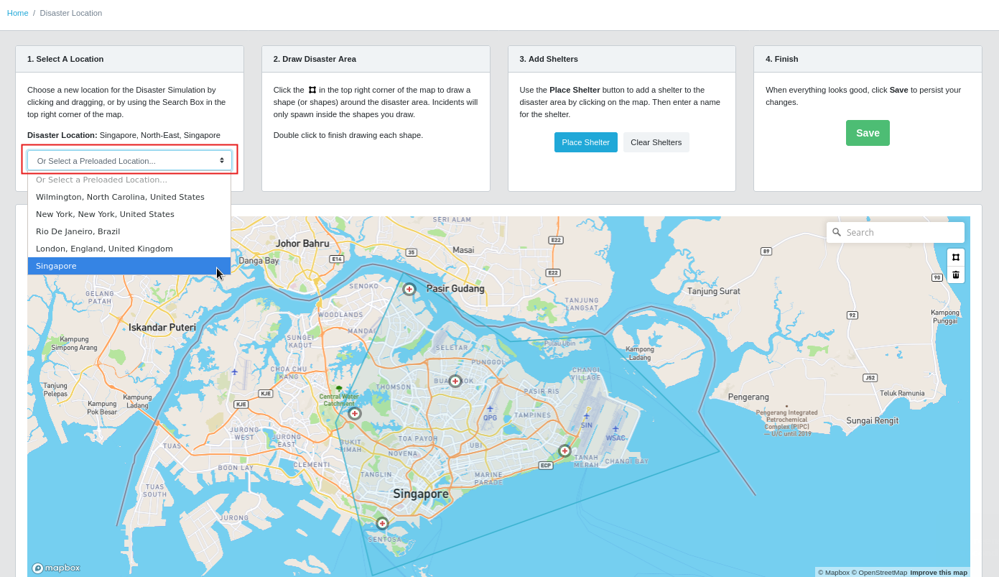
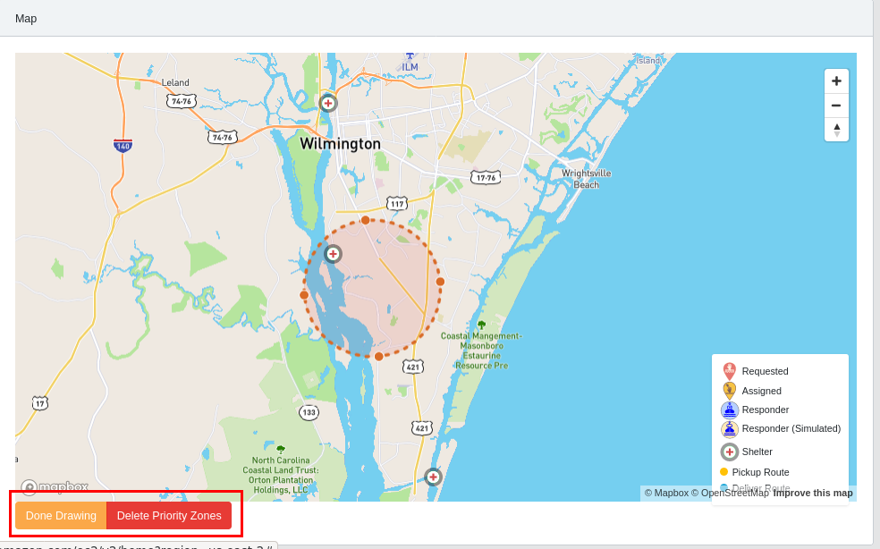
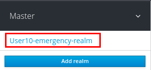
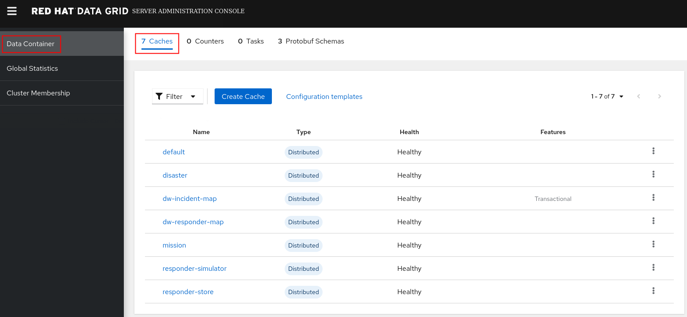

- [1. Emergency Response Admin Console](#1-emergency-response-admin-console)
  - [1.1. Disaster Location](#11-disaster-location)
  - [1.2. Procedure](#12-procedure)
  - [1.3. Priority Zone](#13-priority-zone)
    - [1.3.1. Procedure](#131-procedure)
- [2. SSO Admin Console](#2-sso-admin-console)
- [3. Kafdrop Web Console](#3-kafdrop-web-console)
- [4. Red Hat Data Grid](#4-red-hat-data-grid)


This guide details the privileged functions available to the Emergency Response Demo administrator or presenter.


# 1. Emergency Response Admin Console

As part of the Emergency Response Demo installation process, a privileged user is created using the following credentials:

**username:** incident_commander <br/>
**password:** [Defined Here](https://github.com/Emergency-Response-Demo/install/blob/master/ansible/playbooks/group_vars/sso_theme_realm.yml#L7)


This user has the ability to manage priority zones as well as the location of the disaster. Further details about these functions can be found below.

## 1.1. Disaster Location

The incident commander has the ability to change the location at which the disaster simluation is set. If your audience is unfamiliar with Wilmington, North Carolina, this is a great opportunity to use a location that is more well-known or colloquial.

## 1.2. Procedure

1. In the Emergency Response web console, authenticate in as:  _incident_commander_. From the Disaster Location page, refer to the instructions on the wizard. *If you don't see a link for Disaster Location, you're probably not logged in as the correct user (incident_commander).*

_**Note** Be sure to perform this step **before** generating incidents and responders. Generated markers use disaster location data when they are **created**, so updating the location will not affect existing incidents and responders._



## 1.3. Priority Zone

The incident commander has the ability to create _priority zones_ in the _inclusion zone_ of the _disaster area_.  A priority zone could simulate critical conditions (power lines in the water, gas leaks, etc.).  It's recommended that priority zone's be placed within the _inclusion zone_.   Once placed, priority zones give affected incidents elevated priority so they get matched with available responders more quickly.

### 1.3.1. Procedure

1. From the Dashboard, click the **Create Priority Zone** button in the bottom left corner of the map. *If you don't see the button, you're probably not logged in as the correct user (incident_commander).*

2. Drag to create a circle on the map, then adjust the position and size as you see fit. Once you're done, click **Done Drawing**. You may optionally create additional priority zones by repeating this step.

_**Note** The most effective way to demonstrate this feature is to first generate a bunch of incidents, then draw a priority zone around a collection of them, **then** generate responders. If there is a pool of responders waiting for incidents to be generated, incidents will be assigned in the order they are created, and it will appear as though the priority zones are not being taken into account._



# 2. SSO Admin Console
Red Hat Single Sign-On (RH-SSO) provides web security for the various user and admin consoles of the ER-Demo.
It does so by implementing the *Authorization Code Flow* protocol of the *OpenID Connect Specification*.

RH-SSO supports all ER-Demo *instances* that may be deployed on an OpenShift cluster.
Each ER-Demo *instance* utilizes the security settings provided to it by its own dedicated *SSO Realm* in RH-SSO.

As an RH-SSO, you can manage all SSO Realms via the following:

1. Point a browser tab to the output of the following command:
   ```
   echo -en "\n\nhttps://$(oc get route sso --template='{{ .spec.host }}' -n user-sso)/auth/admin/master/console/#/realms/master\n\n"
   ```
   


2.  Authenticate in the _master_ realm of SSO using a userId of _admin_ and a password determined via the following:
    ```
    oc project user-sso

    pod_id=$(oc get pod -o json | jq '.items[]|select(.metadata.labels.deploymentConfig=="sso").metadata.name' | sed 's/"//g')

    oc rsh $pod_id env | grep SSO_ADMIN_PASSWORD

    ```

3.  Switch to your desired SSO realm by hovering over the realm drop-down in the top-left of the page:
   
    


# 3. Kafdrop Web Console
The open-source [kafdrop](https://github.com/obsidiandynamics/kafdrop) admin console for Kakfa / Red Hat AMQ Streams is included as a KNative Service in the Emergency Response demo.  This admin console provides insight regarding topics, partitions, consumer groups and messages.  You can access and utilize this admin console as follows:

1.  Point a browser tab to the output of the following command:
    ```
    OCP_USERNAME=user1  # CHANGE ME IF NEEDED

     echo -en "\n\n$(oc get kservice kafdrop --template='{{ .status.url }}' -n $OCP_USERNAME-er-demo)\n\n"
    ```

    NOTE:  You may have to wait for about 15 seconds after invoking this URL.  The Kafdrop admin console is deployed as a *KNative Serving* service and configured to scale to zero.  It'll take a bit for a new kafdrop pod to spin up.

    

2.  Scroll down the page to view the list of Kafka Topics
    Notice the number of partitions per topic.  A partition is a single *commit log* in Kafka.  Messages are written to the partition in an append-only fashion, and are read in order from beginning to end.  Note that as a topic typically has multiple partitions, there is no guarantee of message time-ordering across the entire topic, just within a single partition.  Partitions are also the way that Kafka provides redundancy and scalability.  Each partition can be hosted on a different server, which means that a single topic can be scaled horizontally across multiple servers to provide performance far beyond the ability of a single server.
3.  Click any of the topics

    

    Notice the list of consumers registered to consume messages from this topic.  In addition notice the Partition Details.

4.  In the top left corner of the topic panel, click:  *View Messages*.
5.  For the *Message format* filter, select:  *DEFAULT*.
    (The *DEFAULT* format corresponds to JSON serialization, which is what ER-DEMO currently uses for all async message traffic).
6.  Notice the list of messages in this topic.
    Any of the messages can be expanded to view the entire payload.
    
    

    

# 4. Red Hat Data Grid
Red Hat Data Grid serves as a *distributed* data store for *mission* and *disaster* (ie:  priority zones, shelter locations, disaster-area, etc) information.  Red Hat Data Grid provides a web based administration console that can be enabled as follows:

1.  Point a browser tab to the output of the following command:
    ```
    OCP_USERNAME=user1  # CHANGE ME IF NEEDED

     echo -en "\n\nhttps://$(oc get route datagrid-service-external --template='{{ .spec.host }}' -n $OCP_USERNAME-er-demo)/console\n\n"
    ```
2. Authenticate using the following credentials:   *demo* / *demo*
3. View the details of each of the configured remote caches in the *Data Container* tab:
   
4. Click on any of the caches and notice the quantity of cache *entries*
   
5. For more metrics about a specific cache, click on the *Metrics* tab
   
