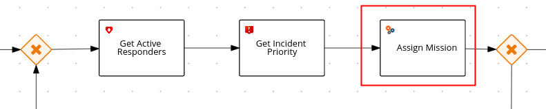

- [1. Overview](#1-overview)
  - [1.1. Application Architecture](#11-application-architecture)
  - [1.2. Service Communication](#12-service-communication)
- [2. Incident Service](#2-incident-service)
- [3. Process Service](#3-process-service)
  - [3.1. ER-Demo Business Process](#31-er-demo-business-process)
  - [3.2. Responsibilities](#32-responsibilities)
  - [3.3. Interaction with other ER-Demo services](#33-interaction-with-other-er-demo-services)
  - [3.4. Assign Mission rules](#34-assign-mission-rules)
  - [3.5. Architecture](#35-architecture)
- [4. Incident Priority Service](#4-incident-priority-service)
- [5. Responder Service](#5-responder-service)
- [6. Disaster Service](#6-disaster-service)
- [7. Mission Service](#7-mission-service)
- [8. Emergency Web Console](#8-emergency-web-console)
- [9. Demo Simulators](#9-demo-simulators)
  - [9.1. Responder Simulator](#91-responder-simulator)
  - [9.2. Disaster Simulator](#92-disaster-simulator)
- [10. Datawarehouse Service](#10-datawarehouse-service)
- [11. Evacuee Find Service](#11-evacuee-find-service)
- [12. Kafdrop](#12-kafdrop)
  

# 1. Overview

The Emergency Response Demo application consists of multiple runtimes and frameworks: Quarkus, Node, Vert.x, JBoss Data Grid, AMQ Streams (Kafka on OpenShift), RH-SSO, Prometheus and much more.


## 1.1. Application Architecture


## 1.2. Service Communication


Details of each of the core application components of the demo application are provided in the remainder of this document.

# 2. Incident Service

  - **Runtime**: Spring Boot

  - **Application Services Products / Components**: 
    - Red Hat AMQ-Streams

  - **Other Components**: Postgres DB
  - **Source code**: [incident-service](https://github.com/Emergency-Response-Demo/incident-service)
  - **Serverless Enabled**:  no

The Incident Service exposes an API for registering new Incidents and
retrieving information about existing Incidents. An endpoint is also
exposed for resetting Incident state (this is typically used by
simulator services for managing and resetting the demo).

When a new Incident is received, the Incident details are stored in the PostgreSQL
database and a new message is sent out on the *topic-incident-event* Kafka
Topic.

The Service also listens on Kafka to the *topic-incident-command* topic
for updates to Incidents and stores the latest Incident state in its PostgreSQL database.

  - Send: topic-incident-event

  - Listen: topic-incident-command

To view the database schema that supports the *incident-service*, execute the following from the command line:

`````
$ ERDEMO_NS=user1-er-demo    # CHANGE ME (if needed)

$ oc rsh `oc get pod -n $ERDEMO_NS | grep "^postgresql" | grep "Running" | awk '{print $1}'`

$ psql emergency_response_demo

emergency_response_demo=# \d reported_incident
`````


# 3. Process Service

  - **Runtime**: Spring Boot

  - **Application Services Products**:
    
      - Red Hat Process Automation Manager (PAM)
      - Red Hat AMQ Streams
    
  - **Other Components**:
    - *process-service-postgresql*
    - *incident-process-kjar*
    - *cajun-navy-rules*
  - **Source code**:
    - [process-service](https://github.com/Emergency-Response-Demo/process-service)
    - [incident-process-kjar](https://github.com/Emergency-Response-Demo/incident-process-kjar)
    - [cajun-navy-rules](https://github.com/Emergency-Response-Demo/cajun-navy-rules)
  - **Serverless Enabled**:  no
  - **Deep-dive video**: [The Value of Red Hat PAM to ER-Demo](https://youtu.be/lZr5B-Ms_6A)

## 3.1. ER-Demo Business Process
The Process Service manages the overall business process flow of the Emergency Response Demo scenario.  
It, along with the Red Hat AMQ Streams brokers, is at the heart of the ER-Demo's *Event Driven Architecture*.
In particular, it serves as the orchestrator of _events in motion_ between the various services of the application.


The business process is implemented using the *Business Process Management Notation* [(BPMN2) standard](https://www.omg.org/bpmn/).  BPMN2 is similar to other business process modelling technologies such as Visio.  However, unlike Visio, BPMN2 is a standard that is implemented as XML that can subsequently be parsed, validated, compiled and executed at runtime.  In the Emergency Response application, Red Hat's Process Automation Manager product is used to parse, validate, compile and execute BPMN2.

The business process of the Emergency Response demo is best characterized as *Straight-Through*.
It meets the criteria of a *straight-through* business process in that its flow is known upfront at design-time and at runtime its lifecycle starts and completes in an automated manner.  More elaboration of the different types of business processes can be found [here](/Business_Patterns.md). 

This process diagram is version controlled in a project called: *incident-process-kjar* .
It can be viewed in any number of BPMN2 editors such as: *Business Central* (from Red Hat Process Automation Manager), *[bpmn.new](https://bpmn.new/)*, or using the *[BPMN Editor](https://github.com/kiegroup/kogito-tooling/releases)* plugin for Microsoft vscode.
The *incident-process-kjar* project is compiled and loaded as a dependency into the *process-service* project.

## 3.2. Responsibilities 
The process-service is responsible for the following:

* **Microservice Orchestration**
It orchestrates the interactions of the other services of the Emergency Response demo application to complete the end-to-end business scenario: simulation of volunteer responders evacuating communities members to shelter after a hurricane.

* **Management of wait-states**
The end-to-end lifecycle of the business scenario is *long-running*.  It can take seconds, minutes and even hours for some of the steps of the business scenario to complete.  When each of these business process steps are being executed, the business process instance is temporarily placed in a *wait-state*.  In particular, its state is persisted in the corresponding *process-service* PostgreSQL database.  When the step in the business process completes, a signal is sent to the process service to resume the process instance and continue to the next task in the business process.

  The existing in-flight ER-Demo process instances can be viewed in the *process-service-postgresql* database as follows:

  `````
  $ ERDEMO_NS=user1-er-demo    # CHANGE ME (if needed)

  $ oc rsh `oc get pod -n $ERDEMO_NS | grep "^process-service-postgresql" | grep "Running" | awk '{print $1}'`

  $ psql rhpam

  rhpam=# \d processinstanceinfo

  rhpam=# select count(instanceid) from processinstanceinfo;

  `````

## 3.3. Interaction with other ER-Demo services
The Process Service interacts with other ER-Demo services primarily by consuming and producing Red Hat AMQ Streams messages.
For example:  When a new Incident is reported on the *topic-incident-event* topic, the process Service kicks off a new BPM process to manage the new Incident.  When a Responder is shown as available (via the *topic-responder-event* topic), the BPM process is updated to reflect this. As the Mission progresses and additional messages are received on the *topic-mission-event* topic, the BPM process is updated to reflect the latest state.  Another example occurs when the _Create Mission Command_ node is reached:  the RH-PAM based process service emits a _CreateMissionCommand_ message containing the details of the mission to create (IDs of responder and incident as well as coordinates of the incident, responder and shelter locations).  This _CreateMissionCommand_ message is consumed by the _MissionService_.

The Process Service sends out multiple types of messages on various Topics in response to the incident progressing through its lifecycle:

  - **Send**: topic-mission-command, topic-responder-command, topic-incident-command, topic-incident-event

  - **Receive**: topic-incident-event, topic-responder-event, topic-mission-event


## 3.4. Assign Mission rules
One of the *service tasks* in the *incident-process* BPMN2 process definition is called:  *Assign Mission*.  This service task is of type: *BusinessRuleTask*

.

When the process instance reaches this service task, it invokes the *technical rules* that are version controlled in the *cajun-navy-rules* project.  These *technical rules* are authored in the *Drools Rule Language* and loaded into the process-service.

## 3.5. Architecture
The *process engine* of Red Hat Process Automation Manager can be deployed and invoked in a variety of manners.
For the purpose of the Emergency Response Demo application, the *process engine* is embedded directly in a SpringBoot microservice application.  The *process-engine* is invoked asynchronously by sending it messages on various AMQ Streams topics.

The AMQ Streams message producers are implemented as custom *work-item-handlers*.
A *workItem* extends the capabilities of the process engine.

Incidentally, this architecture approach most closely resembles the architecture approach implemented in Red Hat's upcoming *cloud-native business automation* project:  [kogito](https://kogito.kie.org/).  With Kogito, the process engine will likely run in Quarkus (instead of SpringBoot) and many of the work-item-handlers needed to inter-operate with AMQ Streams will be auto-generated.

# 4. Incident Priority Service

  - **Runtime**: Vert.x

  - **Middleware Products / Components**:
    - Red Hat Decision Manager
    - AMQ Streams

  - **Source Code**: [incident-priority-service](https://github.com/Emergency-Response-Demo/incident-priority-service)
  - **Serverless Enabled**:  no

When the process service is unable to assign a responder to an incident, an IncidentAssignmentEvent is sent to an AMQ Streams broker.
The incident priority service consumes these events and raises the priority for each failed assignment.
Uses an embedded rules engine to calculate the priority of an incident and the average priority.
The rules engine uses a stateful rules session.

# 5. Responder Service

  - **Runtime**: Spring Boot

  - **Middleware Products / Components**: AMQ-Streams

  - **Other Components:** Postgres DB
  
  - **Source code**: [responder-service](https://github.com/Emergency-Response-Demo/responder-service)
  - **Serverless Enabled**:  no

The Responder Service exposes an API for managing Responders, including
registering new Responders, retrieving information about all available
responders and retrieving information about specific responders.
Endpoints are also exposed for removing responders and resetting
responder state (these are typically used by simulator services for
managing and resetting the demo).

When a new Responder is registered, the Responder details are stored in
the database.

The Service also listens on Kafka to the topic test-topic for updates to
Responders and stores the latest Responder state in the Database. If the
update to the responder includes an Incident Id (i.e. if the responder
has been assigned to work on an Incident) the services also sends a new
Kafka message to the topic test-topic.

  - Send: test-topic

  - Listen: test-topic

# 6. Disaster Service

  - **Runtime**: Vert.x
  
  - **Middleware Components:** JDG
  
  - **Source code**: [disaster-service](https://github.com/Emergency-Response-Demo/disaster-service)
  - **Serverless Enabled**:  no

The Disaster Service exposes an API for managing the disaster's metadata, including: the coordinates and magnification for the center of the disaster; the list of inclusion zones (geopolygons in which incidents and responders should spawn); and the list of shelters and their locations.

Tracking this data dynamically allows the incident commander to change the location of the disaster to match the geography in which the demo is being performed.

# 7. Mission Service

  - **Runtime**: Vert.x

  - **Middleware Products / Components:** JDG, AMQ Streams

  - **Other Components:** (MapBox API)[https://www.mapbox.com]
  
  - **Source code**: [mission-service](https://github.com/Emergency-Response-Demo/mission-service)
  - **Serverless Enabled**:  no

The Mission Service exposes an API for managing Missions, including
getting a list of mission keys, getting a specific mission by key,
clearing all missions and getting missions assigned to a specific
responder.

The Mission Service listens on Kafka to the topic-mission-command topic for details of new or updated missions being created (as per the: _CreateMissionCommand_ message). The mission service calls the route planner service to obtain the route using the responders location as a starting point, the victims location as a way point and the shelter location as the final destination. The Emergency Response application uses the MapBox API for this (https://www.mapbox.com). The route consists of a list of _MissionStep_ instances. The mission object (with MissionStep details) are then stored in JDG.

The Mission Service sends updates to Kafka on the topic-mission-event
topic in response to mission state change events such as when a mission
is created, when an API request is received (e.g. to complete all
missions). The Mission service also sends updates to Kafka on the
topic-responder-command when missions are completed to indicate that the
Responder is available for a new mission.

  - Send: topic-mission-event, topic-responder-command

  - Receive: topic-mission-command, topic-responder-location-update

# 8. Emergency Web Console

  - **Runtime**: Node.js, Angular

  - **Middleware Products / Components:** Red Hat SSO
  
  - **Source code**: [Emergency Console](https://github.com/Emergency-Response-Demo/emergency-console)
  - **Serverless Enabled**:  no

The emergency console is the front end UI for the Demo Solution. It provides the following main views:

  - Incident Commander Dashboard: The overall view of all Incidents,
    Responders and Missions

  - Responder Interface: The view for an individual responder which
    shows their current mission, including the router to the Incident
    and onward route to the shelter

  - Incidents: A tabular list of all incidents

The console communicates with several of the back end services (Incident, Mission & Responder) to display real time data via WebSockets.

The Emergency Web Console is secured via a *OpenID Connect clients* configured in a Red Hat SSO *realm*. 

# 9. Demo Simulators

The following components are used to control the demo and simulate
events which are needed for the demo, but which can not be sourced from
/ represented in the real world (i.e. Incidents, Responder Bots,
Responder movement around the map).

## 9.1. Responder Simulator

  - **Runtime**: Vert.x

  - **Middleware Components:** None

  - **Other Components:** None
  
  - **Source code**: [Responder Simulator](https://github.com/Emergency-Response-Demo/responder-simulator)
  - **Serverless Enabled**:  no

The Responder Simulator is responsible for moving responders (both bots
and humans) around the map during missions. As the demo requires the
movement of personnel to function and since we can not have real people
actually moving many miles for each Mission, this simulator is required
to allow the demo to function.

The Responder simulator listens on the topic-mission-event for details
of active responders that need to be moved on the map. The simulator
them periodically updates (default every 10 seconds) the responders
location (based on the mission route received) to show the responder at
the next location. As the simulator moves responders, it emits messages
on the topic-responder-location-update Topic.

  - Send: topic-mission-event

  - Receive: topic-responder-location-update

## 9.2. Disaster Simulator

  - **Runtime**: Vert.x

  - **Middleware Components:** None

  - **Other Components:** None
  
  - **Source code**: [Disaster Simulator](https://github.com/Emergency-Response-Demo/disaster-simulator)
  - **Serverless Enabled**:  no
  

The Disaster Simulator is used for managing / coordinating the demo. It
exposes a basic UI which allows a user to add and remove Incidents and
Responders in order to drive the demo forward.


The Disaster Simulator uses HTTP API requests to the Incident Service,
the Responder Service the Mission Service and the Incident Priority
Service in order to manage data creation / deletion.

# 10. Datawarehouse Service

  - **Runtime**: Quarkus
  
  - **Middleware Components**: Red Hat AMQ Streams, Red Hat Data Grid
  
  - **Other Components**: PostgreSQL, Grafana
  
  - **Source code**: [Datawarehouse Service](https://github.com/Emergency-Response-Demo/datawarehouse)
  - **Serverless Enabled**:  Yes, scale to one

The *Datawarehouse Service* supports the creation of business dashboards that could be used by a *Mission Commander*.
The service is architected in an _Extract-Load-Transform_ (ELT) manner.  In particular, the *Datawarehouse Service* is a Quarkus based service that listens on all Red Hat AMQ Streams based message traffic in the ER-Demo.  Using the data in these messages, it populates a de-normalized relational database (implemented using PostgreSQL) whose schema supports dashboard related queries.  Temporary data accumulated during the lifecycle of the mission is stored in Red Hat Data Grid until the mission is completed and its history archived in the datawarehouse.  Grafana renders the dashboards generated from queries on the PostgreSQL based datawarehouse.


Grafana provides [an SQL plugin for PostgreSQL](https://grafana.com/docs/grafana/latest/features/datasources/postgres/).  This plugin is leveraged to render various *Mission Commander Dashboards*.  More detail about each of these dashboards can be found in the [getting started](/gettingstarted.md) guide.

Beyond and *ELT* approach, there are many ways in which similar *Business Activity Monitoring* (BAM) capabilities could have been achieved as follows:

1. **ETL**
   
   Extract-Transform-Load:  Process data in batches from source databases (ie: *incident* and *reporting* databases) to a data warehouse.  An ETL *pipeline* is typically implemented that validates, transforms and stages the data prior to pushing it to the production datawarehouse.  There are many proprietary products that serve this purpose.  ETL has the perceived benefit of saving time and storage because you don't need to store the data, modify it and store it again. The main drawback of this approach is that the transformations that happen to the data in the pipeline tie the hands of those who wish to process the data farther down the pipe. ie: If the pipeline between MongoDB and MySQL filters certain events or remove fields from records, all the users and applications who access the data in MySQL will only have access to partial data.  If they require access to the missing fields, the pipeline needs to be rebuilt and historical data will require reprocessing (assuming it is available). [Red Hat Fuse](https://www.redhat.com/en/technologies/jboss-middleware/fuse) could also be utilized to implement this pipeline (most likely with more flexibility and less complication than typical proprietary ETL products).


2. **Change Data Capture**
   
    Change Data Capture, or CDC, is an older term for a system that monitors and captures the changes in data so that other software can respond to those changes. Proprietary data warehouses often have built-in CDC support, since data warehouses need to stay up-to-date as the data changed in the upstream OLTP databases.
    A modern, open-source change data capture platform is available via the [Red Hat sponsored Debezium project](https://debezium.io/). Debezium integrates with the major open-source and proprietary databases in use today.
   
3.  **AMQ Kafka Streams**

    Via the upstream community *Apache Kafka* and *Strimzi* communities, sophisticated dashboards could be created directly by querying [Kafka Streams](https://kafka.apache.org/documentation/streams/).

4. **Data Virtualization**

    [Red Hat Managed Integration](https://access.redhat.com/documentation/en-us/red_hat_managed_integration/1/html/getting_started/concept-explanation-getting-started) (RHMI) includes a *data virtualization* technology based on the open-source [teiid](https://teiid.io/) project.  Using RHMI, a unified view of all of your backend datasources can be presented to a Business Activity Monitoring dashboards.  Specific to the ER-Demo, the *responder*, *incident* and *process engine* databases could be virtualized such that a single unified view could be presented to a BAM dashboard.  Note:  As of August 2020, no new releases of Red Hat Data Virtualization are expected going forward.


# 11. Evacuee Find Service

  - **Runtime**: Quarkus
  - **Source code**: [Evacuee Find Service](https://github.com/Emergency-Response-Demo/find-service)
  - **Serverless Enabled**:  Yes, scale to zero

The evacuee *find-service* exposes a RESTful API that allows for HTTP clients to locate the shelter where an evacuee was dropped off.  This service is expected to serve as the basis of the following future functionality in ER-Demo:

  * API Management of _Find Service_ RESTful endpoint using Red Hat 3scale
  * [Evacuee Find Service web application](https://github.com/Emergency-Response-Demo/findmyrelative-frontend)
  

# 12. Kafdrop

  - **Runtime**: SpringBoot
  - **Serverless Enabled**:  Yes, scale to zero

For information on the use of Kafdrop in ER-Demo, please see the [Administration Guide](/admin_consoles.md#3-kafdrop-web-console)