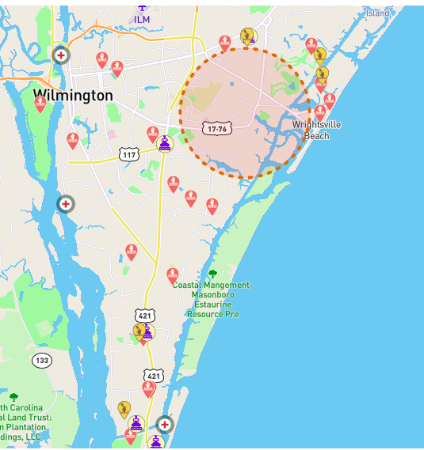
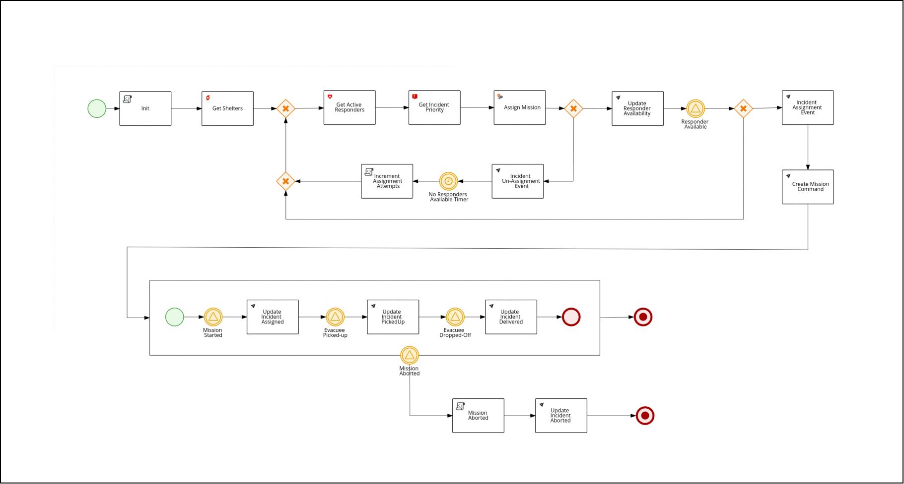
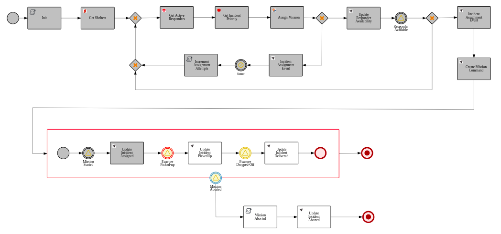
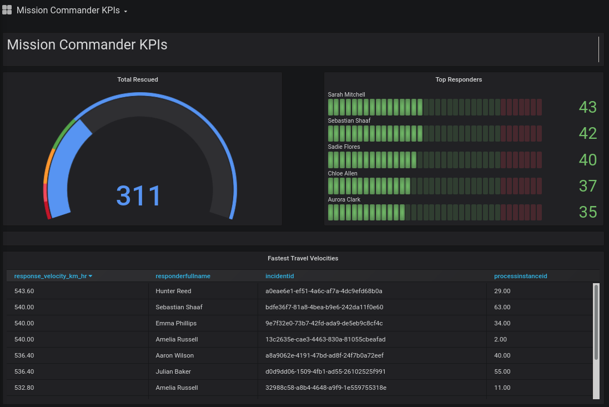
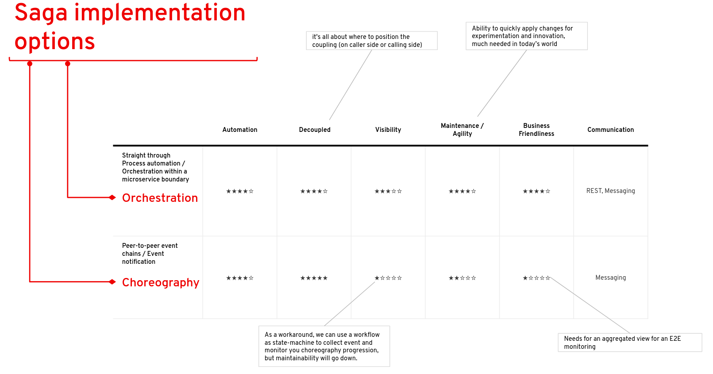
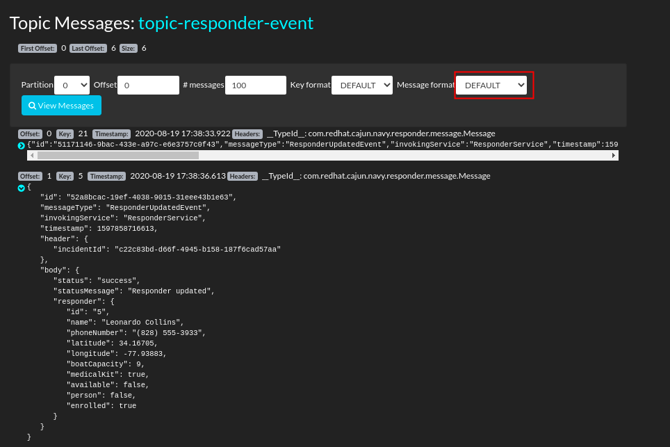

This article is a continuation of the very nice [presentation](https://www.brighttalk.com/webcast/16623/424554?) on *Event Driven Architectures (EDA) and Serverless* delivered on August 16, 2020 by Red Hat's Vice President of Application Services.

The purpose of this article is to elaborate on this presentation from the perspective of how EDA is implemented in Red Hat's *Emergency Response Demo* application (ER-Demo).

# 1. Business Decisions via *Events in Motion*

The ER-Demo application characterizes an *Event Driven Architecture* (EDA).  The primary means of interaction between the various services of the application is via *events*.  

Each of these events are in motion and provide a critical story from both a technical and business use case perspective.  Take for instance the ER-Demo's *CreateMissionCommand* event.  What significance does it provide ?

- **Technical value:**
  The *CreateMissionCommand* event is a trigger to the ER-Demo's *MissionService* to generate a *Mission* that maps a selected responder to an incident.  The ER-Demo's *datawarehouse service* also consumes this same event to populate a database that facilities business activity monitoring.

- **Business value:**
  In a real-world scenario, the *CreateMissionCommand* event would be an actual assignment of a volunteer responder to a specific evacuee who is in need of assistance and has called for aid.  An event reflects an action in the real-world.

For the remainder of this section, I will further elaborate on the business value of events.

Events can be exposed to business owners to provide *situational awareness* in near real-time.  In the ER-Demo application, this *situational awareness* is exposed to the *incident commander* via the web console.  The web console is a consumer of the same events that are being produced and consumed by all other ER-Demo services.

A natural consequence of this *situational awareness* via *events in motion* is that business owners are now in a better position to make business decisions.

For example, from the snapshot above of the ER-Demo web console, what could be deduced and what decisions might an *incident commander* make ?  Notice that at this particular point in time, there are no longer any incidents in the circular _priority zone_.  We can deduce that responders have rescued all evacuees in this zone.  Subsequently, maybe the incident commander is now in a better position to make some adjustments.  Maybe the incident commander could decide to add a new shelter ?  Or maybe the incident commander now feels comfortable with how rescuee operations have progressed thus far and is now in a position to re-focus their personal attention to whatever is the next priority ?

# 2. Orchestration of *Events in Motion*

From a technical perspective, each of the events used in the ER-Demo application could have been produced and consumed by services without a central coordinator.  This is known as a *choreography*.  However, this approach can lead to a system that can be fairly opaque.  For example, several years ago, Netflix attempted choreography and ran into [several of these types of problems](https://netflixtechblog.com/netflix-conductor-a-microservices-orchestrator-2e8d4771bf40).  

As an alternative approach to a *choreography* (with no central coordinator), the ER-Demo implements a business process (in the form of BPMN2) that explicitly *orchestrates* the event-driven interactions between business services.

Among other benefits, the use of a business process orchestration engine brings transparency and clarity to the otherwise flurry of events.  At any given time, the state of each ER-Demo *incident* is known.

Afterwards, the *audit trail* of each business process can be collected and aggregated to expose powerful business related dashboards.

A matrix comparison between Orchestration and Choreography patterns (both of which are types of [SAGAs](https://microservices.io/patterns/data/saga.html)) can be seen in the following:

# 3. Scaling of *Events in Motion*
In modern applications, the volumes of events that need to be processed and transformed into business intelligence can be enormous.  In order to scale to meet these volumes, there are many considerations at various levels of the application software stack that should be taken into account:

- **Service Thread-model**
  The services of a modern application should leverage a non-blocking, reactive runtime that implements [an event-loop](https://vertx.io/docs/vertx-core/java/#_reactor_and_multi_reactor).  In the Java ecosystem, the [vert.x](https://vertx.io/) platform provides exactly that.  However, for developers writing applications in a reactive manner, this can sometimes be a challenge.  Subsequently, the [Red Hat Quarkus](https://www.redhat.com/en/topics/cloud-native-apps/what-is-quarkus) framework allows developers to program in a more intuitive imperative style while the runtime is always reactive.

  In the ER-Demo, the majority of services are currently written directly in vert.x or in Quarkus.  The remainder are written in SpringBoot.  The intent is to migrate all SpringBoot services to Quarkus.

- **Messaging Infrastructure**
  Red Hat's AMQ Streams platform builds off the innovation from the open-source Strimzi and Apache Kafka projects and brings those technologies as a supported offering on Red Hat's OpenShift platforms.

  AMQ Streams is an event streaming platform that [trades-off some features](https://medium.com/@graemecolman/mind-your-amqps-or-kafka-or-interconnect-what-is-in-the-red-hat-messaging-box-9ed5aa590e92) found in traditional messaging brokers for simplicity and message throughput.  Each broker in a cluster is capable of processing 100s of megabytes per second of events.  It is tailored specifically for event-driven and streaming use cases.

  Also a consideration is the ability to scale out your messaging infrastructure across clusters in different geographies.  AMQ Streams provides this capability via support for [Kafka MirrorMaker 2](https://strimzi.io/blog/2020/03/30/introducing-mirrormaker2/).

- **Data Tier**
  The data tier of an application is often the most difficult to scale.  Traditional relational databases tend to be bottlenecks in modern applications.  Subsequently, the ER-Demo application relies heavily on the *distributed cache* capabilities of [Red Hat Data Grid](https://www.redhat.com/en/resources/red-hat-jboss-data-grid-technology-overview).  Red Hat Data Grid is based on the innovation from the [Infinispan](https://infinispan.org/) community project.  Unlike some data grids on the market, the *distributed mode* cache of Infinispan can [scale the data tier horizontally](https://www.youtube.com/watch?v=Kb46QFigx84).  In addition, through the use of a *cache store*, this same data can be persisted for long term durability.

- **On-Demand Elasticity**
  Red Hat's OpenShift Container Platform allows for scaling services of an application via configuration.  In addition, OpenShift also comes out-of-the-box with [OpenShift Serverless](https://red.ht/31Qm6My).  OpenShift Serverless leverages the innovation from the [KNative community](https://developers.redhat.com/topics/serverless-architecture/) to provide demand based *scale-out* and *scale-to-zero* capabilities.  In the ER-Demo app, several of its services (ie:  the datawarehouse service) are implemented as *Knative services*.  The intent is that more of the core ER-Demo services will be migrated to KNative and be configured to *scale to 1*.  The services that are expected to scale elastically on demand via KNative require very fast boot-times.  In the Java ecosystem, Quarkus has become the framework enabling serverless.  One aspect of Quarkus is as a build-time tool that implements *ahead-of-time* compilation on your Java application code [to drastically reduce memory consumption and startup time](https://in.relation.to/2019/03/08/why-quarkus/).  In addition, a Quarkus application can be further compiled into a native binary (via the use of the [Mandrel](https://developers.redhat.com/blog/2020/06/05/mandrel-a-community-distribution-of-graalvm-for-the-red-hat-build-of-quarkus/) open-source technology) for even more drastic reductions at runtime in both memory consumption and startup time.

# 4. Monitoring of *Events in Motion*
To support and evolve a modern Event Driven Architected application, both Dev and Ops teams need visibility to the events.  Currently, the ER-Demo app provides some degree of visibility via the following:

- **Prometheus Metrics rendered via Grafana DashBoards** :

- **Kafdrop** :

More information about the use of these monitoring tools can be found in the [Administration Guide](/admin_consoles.md).

Going forward in future releases of AMQ Streams, expect new innovative improvements to its out-of-the-box monitoring capabilities.

# 5. Triggering of *Events in Motion* 

Events can be produced in massive quantities from a wide variety of sources.

However, what about all of the data that is typically siloed in traditional relational databases ?  Capturing state changes on this data and transforming these state changes into another source of *events in motion* can be incredibly valuable. In particular, if you can do so without making any code changes to any existing apps.

The Red Hat sponsored [Debezium](https://debezium.io/) community project provides the technology to do exactly that.  You can read more details about how the ER-Demo app makes use of Debezium in the following blog post: [Outbox Pattern implementation in ER-Demo process service](/process_service_outbox.md).
