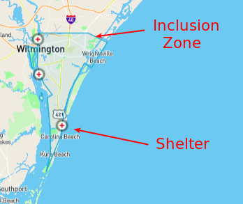
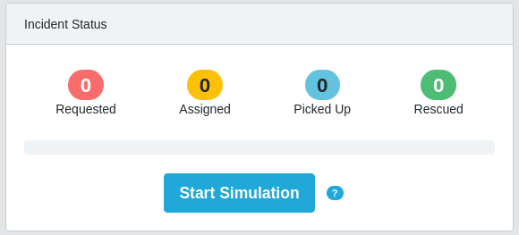

- [1. Overview](#1-overview)
  - [1.1. Purpose](#11-purpose)
  - [1.2. Pre-requisites](#12-pre-requisites)
  - [1.3. Scenario](#13-scenario)
  - [1.4. Consoles](#14-consoles)
- [2. Optional:  Alternative Disaster Location and Priority Zones](#2-optional-alternative-disaster-location-and-priority-zones)
- [3. Incidents](#3-incidents)
- [4. Responder View](#4-responder-view)
  - [4.1. Incidents](#41-incidents)
  - [4.2. Dashboard](#42-dashboard)
    - [4.2.1. Incident Status](#421-incident-status)
    - [4.2.2. Responder Utilization](#422-responder-utilization)
    - [4.2.3. Map](#423-map)
  - [4.3. Mission](#43-mission)
  - [4.4. Review Total Incident and Responder Status](#44-review-total-incident-and-responder-status)
- [5. Process Automation](#5-process-automation)
- [6. Disaster Simulator: Additional Responders](#6-disaster-simulator-additional-responders)
- [7. Clean Up](#7-clean-up)
- [8. Monitoring Dashboards](#8-monitoring-dashboards)
- [9. Troubleshooting Demo Problems](#9-troubleshooting-demo-problems)


# 1. Overview

## 1.1. Purpose
This guide provides a *script* of how to deliver a demonstration using the Emergency Response application.
The target audience of this guide are Emergency Response admins:  those users who have already installed OpenShift and layered the Emergency Response application on to it.

Your attendees of this demonstration might have a wide variety of interests :

1.  **Understand Power of Communities**
    The Emergency Response application is developed and maintained using open-source, Agile and DevOps methodologies and tools.  Executives of both Line of Business and IT departments (along with Red Hat system integrator partners) might be interested in the *Art of the Possible* when incorporating these same methodologies and tools.


2.  **MicroService Architected Application for Hybrid Cloud**
    The Emergency Response application is a microservice architected application that show-cases best of breed Red Hat products integrated together for a hybrid-cloud production environment.  Software architects and application developers of Red Hat system integrator partners and customers will likely be intrigued by the architecture of this application and incorporate its best-practices in their business solutions using Red Hat technologies.


## 1.2. Pre-requisites
This document assumes that you already have an Emergency Response Demo environment available to you.  Details of the installation procedure can be found in the ER-Demo [install documentation](install.md).
If you have any questions or problems, please email: "emer-demo-team at redhat dot com" .

## 1.3. Scenario

A hurricane has hit Wilmington, North Carolina.  There is a dire need to evacuate residents from their homes.  Local community members are willing and able to assist their neighbors.  The following terms are used throughout this scenario:

1. **Rescuees**
    There are people that are in need of being rescued.  Their homes have been flooded and their vehicles are inoperable.  In addition, streets are also flooded and are saturated with dangerous debris.  Rescuees are prepared to evacuate their homes and leave their valuables behind.  The rescuees home is known as the *pick-up* point.  A *rescuee* in need of evaculation at their *pick-up* point is known as an:  *incident*.
    
2. **Responders**
    These are members of the community that have volunteered to assist their neighbors during this dire situation.  They sometimes are also referred to as:  *Rescuers*.  Responders either own or have access to a small boat.

    In a real-world scenario, responders would install the *Emergency Response* application to their mobile phones.  They would then use the mobile app to register details about themselves and their equipment.  For demo purposes, responders are your audience members.  Your audience members use their browser (either from thier laptop or mobile device) to log into the Emergency Response web console to register and fictitiously set thier location on a map.

3. **Pick-up location**
   Where the rescuee resides.  Also known as a *way-point*.
    
4. **Shelters**
   Also known as *Evacuation Centers* or *Drop-off points*.  This is where the responders need to drop off rescuees.  

5. **Disaster Location**
   The default *disaster location* of the Emergency Response application is the city / beach resort of Wilmington, North Carolina, USA.

6. **Disaster Area**
   Sometimes referred to as an *Inclusion Zone*.  Within a *disaster location* is a *Disaster Area*.
   

   The *Disaster Area* for a *disaster location* is the zone where simulated incidents will be generated.
   
Upon the existence of an evacuation *incident* and a suitable volunteer *responder*, the Emergency Response application then simulates the responder navigating to the *pick-up point* and then to the *drop-off point*.


## 1.4. Consoles

Before starting the Emergency Response demo with your audience, it is recommended that you have the following tabs open in a browser so you can easily navigate between them during the demo:

* **Emergency Response console**
  
  - In addition, this is the URL you will want to distribute to members of your audience so that they can elect to serve as a simulated *responder*.
  - To simply the experience for your audience, consider providing a shortened representation of this URL using bit.ly or tiny.url

* **Disaster simulator**
* **Openshift Console** with access to the following namespaces:
    - userX-er-demo
    - userX-tools-erd
    - userX-er-metrics
    - user-sso
    - kafka-operator-erd
* **Grafana Dashboard**

The [Install guide](/install.md) provides details on how to access each of these web consoles.

# 2. Optional:  Alternative Disaster Location and Priority Zones

You as the demo administrator can optinally serve as the Emergency Response application *Incident Commander*.  Among other functionality, the Incident Commander can designate an alternative *Disaster Location* and any *priortiy zones* in that disaster location.

Priortiy Zones simulate critical conditions (power lines in the water, gas leaks, etc.). Once placed, priority zones give affected incidents elevated priority so they get matched with available responders more quickly.

By default, the Emergency Response application does not define any *priority zones* within the default *disaster location* of Wilmington, NC.

For the purpose of your demo, you can optionally change the *disaster location* and introduce Priority Zones by referring to the [Admin Console guide](/admin_consoles.md).


# 3. Incidents

You (as the demo instructor) should create simulated *incidents*.

An *incident* is a request for help from an individual (or group of individuals) that are in need of rescue. Details of an Incident include the location (Lat, Long), the number of people stranded and whether medical assistance is required.

You have two options for generating incidents:

1. **Simulation Easy Button**
   Utilize the *Simulation Easy Button* when your audience would likely prefer to observe the demo instead of participating as responders.  You will want a mechanism to quickly generate both *incidents* and *responders*.
   1. Log into the Emergency Response web console as the *incident_commander* user.  (More details in the [admin_guide](/admin_consoles.md).)
   2. Navigate to: *Dashboard -> Incident Status*.  Notice the *Start Simulation* button.
   

   1. Click on the tool-tip of the *Start Simulation* button.
      Notice that it mentions that if the *Start Simulation* button is clicked, 50 incidents and 25 responders will be created.
   2. Click on the *Start Simulation* button and notice that within a minute, all 50 incidents and 25 responders will have been created.
   
2. **Disaster Simulator**
   The Disaster Simulator is a separate web interface provided by the Emergency Response application.
   The Disaster Simulator allows for full control of the creation and deletion of incidents, responders and missions.
   Utilize the Disaster Simulator if you need to generate incidents and your audience will register as responders.
  

   1.  In the **OpenShift Web Console**, switch to the *userX-er-demo* namespace

   2.  In the list of applications, click the link for **disaster-simulator**:
    
    

   3.  In the section for **Create Incidents**, move to the field for **Number of Incidents** and the desired number of simulated *incidents*.

   4.  Click **Submit**
    
      

The Emergency Response application will attempt to match rescuees with responders based on a variety of factors.  The Emergency Response application uses a decision management system to calculate that match (between rescuee and responder).  In turn, a mission is created.

# 4. Responder View

1.  Instruct your demo attendees to navigate to the URL of the Emergency Response console (ideally a bit.ly or tiny.url representation of that URL).  Those that do so will serve as simulated *responders*.
   
2.  Audience members should click the **Register Now\!** button.
3.  Audience members should enter mock information for themselves as volunteer responders.  After providing this information they should select the following:
    
    1.  **Boat Capacity**:  How many *rescuees* the responder can carry in their boat.  Setting a boat-capability of 10-12 is typically sufficient to be assigned an *incident*.
    2.  **Medical Support**: Set to true if the responder can provide medical/first-aid support.
    
        
        
    
    Indicate to your volunteer responders that the value of these fields that they enter will be used in optimizing assignments of *responders* to *rescuees*.  

4.  Once completed, audience members should click:  **Register**

Once successfully registered, audience members will see the main application screen.


  - This screen has the following links:
    
      - **Dashboard**: The overall view of all Incidents, Responders and Missions
    
      - **Mission**: The view for an individual responder which shows their current mission including the route to the Incident (aka: *pick-up point*) and onward route to the shelter
    
      - **Incidents**: A list of all incidents
    
      - **Github**: Link to the Github repo

## 4.1. Incidents

Instruct your responders to click the **Incidents** link in the left panel.
    
This screen shows a list of incidents.


An *incident* is a request for help from an individual (or group of individuals) that are in need of rescue. Details of an Incident include the location (Lat, Long), the number of people stranded and whether medical assistance is required.

The list should reflect the incidents you previously created via the *Disaster Simulator*.

## 4.2. Dashboard

Instruct the responders to click the **Dashboard** link from the left panel.
    
This screen shows an overall view of all Incidents, Responders and Missions.


### 4.2.1. Incident Status

The Incident Status section tracks the data for number of incidents requested, assigned, picked up and rescued.
These values update in real-time based on application events.

### 4.2.2. Responder Utilization

The Responder Utilization section monitors the total number of responders, active and idle responders.  This section is also updated in real-time based on application events.

### 4.2.3. Map

At this time, the map only depicts several *evacuation centers* (aka: *drop-off points*) as well as the location of current evacuees who are requesting assistance.  These locations are the *pick-up* point (aka:  the location of the *incidents*.)

Later in the demo,  *responders* will be simulated .  At that time, the map will show the location of the incidents, responders and their associated routes.


## 4.3. Mission
The next task is to instruct your responders to set a simulated location (with their boat) on the map.  In a real-world scenario, the Emergency Response mobile app pre-installed on the actual responder's mobile device would be pushing real-time location events to the _responder-service_. 


1.  Instruct your responders to select the link for **Mission** from the left panel.
    
  - This screen shows the current mission for an individual responder.
  - It includes the route that the responder will take to the *pick-up* location (where the *rescuee* resides) and onward route to the shelter.

2.  Instruct your responders to set their location and make themselves available:
    
    1.  Responders should click any location on the map.
     
        
    
    2.  Responders should click their boat icon. It will show the details of their boat profile.
        
        
    
    3.  Responders should click on the **Available** button.
   
        

      - Doing so triggers a series of events in the backend services of the Emergency Response application to assign a Responder to an evacuee's *incident*.  When a Responder is assigned an *Incident*, a *Mission* is created.
        
      - The Mission defines where the Responder needs to go to pick-up the victims of the Incident (the Way Point) and what shelter the victims should be dropped off. The mission also has details of the responders location history.

        Soon enough, your responder's boat should have been assigned to a mission.

3. While still in the **Mission** panel, Responders will view their boat moving towards an incident.
4. Have the responder click on the rescuee's pickup-point.
   
   

   Notice that a lot of information pertaining to the mission is provided.
   Also included is a link to a real-time depiction of the mission's process diagram.
   More about this process diagram is dicussed in the next section.
    
5. Once the responder's boat makes it to the incident location, instruct the responder to click the **Picked Up** button.
    
6. This confirms that the responder has picked up the passengers and their boat will proceed to the shelter.  
  
  
        


## 4.4. Review Total Incident and Responder Status
Responder can gain some perspective of the status of all incidents and responder utilization by returning to the **Dashboard** view.


# 5. Process Automation

The Process Service is responsible for managing the overall process flow of the system. The Process Service operates purely on Kafka messages and does not expose any HTTP API - although it does invoke HTTP APIs in the Responder and Incident Priority Services.

When a new Incident is reported on the topic-incident-event Topic, the process Service kicks off a new BPM process to manage the new Incident.  When a Responder is shown as available (via the topic-responder-event Topic), the BPM process is updated to reflect this. As the Mission progresses and additional messages are received on the topic-mission-event Topic, the BPM process is updated to reflect the latest state.

The Process Service sends out multiple types of messages on various Topics in response to the Incident progressing through the Business Process.

Responders can view the process diagram for an incident.

1.  Instruct the responders to click the **Dashboard** link.

2.  Instruct the responders to click an Incident on the map.
    
      - This will show a pop-up for the incident.
        
        

3. Instruct the responders to click the link for **Process Diagram**
    
      - This will open new tab to view the Process Diagram for this
        incident.
        
        

3.  Responders should review the process diagram for this incident.


# 6. Disaster Simulator: Additional Responders

Via the Disaster Simulator, you (as the demo administrator) can also optionally simulate additional *responders* (above and beyond the responders that have already volunteered from your audience and registered via the *Emergency Console* web app).

1.  In the section for **Create Responders**, move to the field for **Number of Responders** and enter `3`.

2.  Click **Submit**
    
    

3.  Move back to the **Emergency Response Demo Web Console** window

4.  Click the **Dashboard** link.

5.  Confirm that you have incidents and responders.
    
      - You will see activity as the responders are assigned to missions. 
        
        
      - The responders will start moving to rescue the stranded victims.


# 7. Clean Up

You, as the demo administrator, can clean up your application by clearing incidents, responders and
missions.

1.  Move back to the **Disaster Simulator** web console.

2.  Click the buttons to clear application data
    
    1.  Click **Clear incidents**
    
    2.  Click **Clear responders**
    
    3.  Click **Clear missions**
        
        

3.  Move back to the **Emergency Response Demo Web Console** window

4.  Click the **Dashboard** link.

5.  Confirm that all of application data is cleared.

# 8. Monitoring Dashboards
The Emergency Response application comes complete with various dashboards.  
Some of these dashboards are technical.  Some of these dashboards have more of a business slant to them.

These dashboards can bee seen as follows:

1. Navigate to your Grafana route from the *userX-er-metrics* namespace as seen from the following:
   ```
         echo -en "\nhttps://$(oc get route grafana-route -n $OCP_USERNAME-er-metrics --template='{{ .spec.host }}')\n\n"
   ```

2. Authenticate in using the admin user of that namespace or the cluster admin user of the OpenShift cluster.
3. From the *Home* drop-down, click the *Emergency Response Dashboard*
   
4. The technologies used to render the dashboards are as follows:
    - **Prometheus**
      Various Emergency Response services (ie:  the [process-service](https://github.com/Emergency-Response-Demo/process-service)) are enabled to publish events to a Prometheus time-series server.  
      Prometheus includes a local on-disk time series database backed by a PVC in OpenShift.
    - **AlertManager**
      Handles alerts sent by client applications such as the Prometheus server. It takes care of deduplicating, grouping, and routing them to the correct receiver integration such as email, PagerDuty, or OpsGenie. It also takes care of silencing and inhibition of alerts.
    - **Grafana**
      Grafana integrates with the Prometheus time-series database to provide dashboards.

5. From the *Home* drop-down, click the *Mission Commander KPIs
   

    Currently, this dashboard includes the following KPIs:
      1. **Total Rescued**
         Displays the total number of rescued since the system went live.

      2. **Top Responders by number of evacuees**
         Displays the responders that have evacuated via the boats the most number responders.

      3. **Fastest Travel Velocities**
         Displays the responders missions where the responder travelled the fastest (in Km/hr).
         - **NOTE:** These velocities are highly unrealistic due to the responder's rate of travel being simulated (for the purpose of facilitating the demo).  Real-world speeds between pick-up and drop-off points would likely be one or two orders of magnitude slower.  In addition, the total times to rescue would likely be greatly affected by circumstances at the pick-up and drop-off points.  ie: assistance in loading evacuees and their minimum belongings into rescuee boats; safety briefs; hazardous debris encountered during the travel that would require the responder to deviate from the optimal route; etc.


# 9. Troubleshooting Demo Problems

1. **Maps Do Not Appear in Emergency Console**
   - **Symptom:**
     After successful login, the maps do not appear in either the *Dashboard* nor the *Mission* panels.
   - **Problem Triage:**
     Map layers such as disaster locations, priority zones and shelters are all cached in the *disaster* cache of JBoss Data Grid.  These mapping layers are exposed by the RESTful API of ER-Demo's *disaster-service*.  The *disaster-service* API is invoked everytime a user navigates to either the *Dashboard* and *Mission* panels of the ER-Demo web console.  Subsequently, check for the following:
     1. Errors in *emergency-console* pod that indicate problems reaching the *disaster-service*.
     2. Errors in the *disaster-service* pod that indicate problems accessing the *disaster* cache in JBoss Data Grid.
     3. Use the cli of JDG to ensure the *disaster* cache exists; ie:
         `````
         $ oc rsh datagrid-service-0
         $ /opt/infinispan/bin/cli.sh --connect=$HOSTNAME:11222       # userId/passwd = demo/demo
         > cd caches/disaster

         > ls
         disaster

         `````

2. **Responders Do Not Seem to Move**
   - **Symptom:**
     The Responder has been assigned a mission and even the process diagram appears when clicking the pickup point.
     The Responder however does not seem to move to the pickup point.
   - **Problem Triage:**
     Check the logs of the userX-responder-simulator pod.  Do you see any exceptions ?  If so, restart the userX-responder-simulator deployment config.
