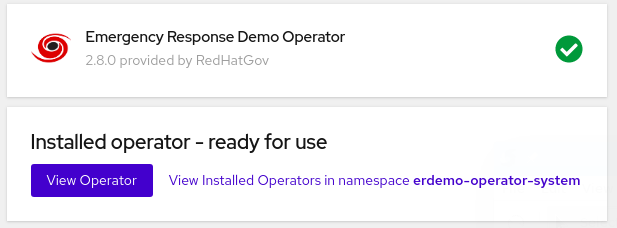
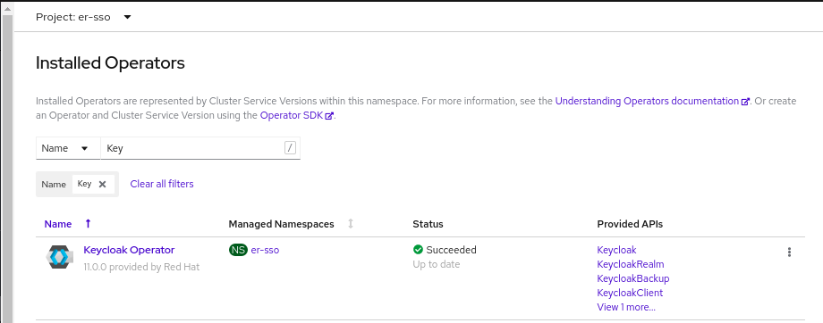

- [1. Overview](#1-overview)
- [2. MapBox Access Token](#2-mapbox-access-token)
- [3. Turn-Key ER-Demo Environment](#3-turn-key-er-demo-environment)
  - [3.1. Overview](#31-overview)
  - [3.2. Order Emergency Response Demo](#32-order-emergency-response-demo)
    - [3.2.1. Confirmation Emails](#321-confirmation-emails)
    - [3.2.2. ER-Demo Web Consoles](#322-er-demo-web-consoles)
    - [3.2.3. **Emergency Response Console**](#323-emergency-response-console)
    - [3.2.4. **Disaster Simulator**](#324-disaster-simulator)
    - [3.2.5. **Grafana Dashboards**](#325-grafana-dashboards)
- [4. Bring Your Own OpenShift 4 Cluster](#4-bring-your-own-openshift-4-cluster)
  - [4.1. Overview](#41-overview)
    - [4.1.1. Minimum Requirements](#411-minimum-requirements)
  - [4.2. Installation](#42-installation)
    - [4.2.1. Operator](#421-operator)
    - [4.2.2. ERDEMO Resource](#422-erdemo-resource)
    - [4.2.3. Installation Complete !](#423-installation-complete-)
      - [4.2.3.1. Sanity Checks](#4231-sanity-checks)
  - [4.3. Deployment Topology](#43-deployment-topology)
  - [4.4. ER-Demo Web Consoles](#44-er-demo-web-consoles)
    - [4.4.1. *Emergency Response Console*](#441-emergency-response-console)
    - [4.4.2. *Disaster Simulator*](#442-disaster-simulator)
    - [4.4.3. *Grafana Dashboards*](#443-grafana-dashboards)
- [5. Appendix](#5-appendix)
  - [5.1. Vanilla OCP4 from RHPDS](#51-vanilla-ocp4-from-rhpds)
    - [5.1.1. Overview](#511-overview)
    - [5.1.2. Risks and Challenges](#512-risks-and-challenges)
    - [5.1.3. Order OCP4](#513-order-ocp4)
    - [5.1.4. Confirmation Emails](#514-confirmation-emails)
    - [5.1.5. Access](#515-access)


# 1. Overview
By this time you are excited and want to try out this application.  To do so, you will need to install the application on an OpenShift Container Platform (OCP) 4.* environment.  You have the following two options:

1. **Turn-Key ER-Demo Environment**
   An Emergency Response Demo application can be obtained via Red Hat Product Demo System (RHPDS).
   This is the recommended approach for most users.

1. **Bring Your Own OpenShift 4 Cluster**
   As an alternative, you can layer an Emergency Response demo environment on an existing OpenShift platform.
   The installation of the ER-Demo application on your OpenShift cluster is done using an Ansible based operator.
   This approach is recommended for contributor of the Emergency Response Demo.

NOTE:  In all cases, you will need your own MapBox Token.  (As per the next section).


# 2. MapBox Access Token

The Emergency Response application makes use of a third-party SaaS API called [MapBox](https://www.mapbox.com/).
MapBox APIs provide the Emergency Response application with an optimized route for a responder to travel given pick-up and drop-off locations.  To invoke its APIs, MapBox requires an [access token](https://docs.mapbox.com/help/how-mapbox-works/access-tokens).  For normal use of the Emergency Response application the _free-tier_ account provides ample rate-limits.


Save your newly created Map Box Access Token.
You'll use it in the following sections.

# 3. Turn-Key ER-Demo Environment
Use this provisioning approach if you'd like a *turn-key* experience for acquiring your own Emergency Response demo environment.

<span style="color:red">As per the previous section, you will need a MapBox Access Token.</span>.


## 3.1. Overview

The _Red Hat Product Demo System_ (RHPDS) provides a wide variety of cloud-based labs and demos showcasing Red Hat software.
One of the offerings from RHPDS is a cloud-based OCP 4 environment that meets all of the minimum requirements to support an installation of the Emergency Response application.  The default shutdown and lifetime durations of this environment are as follows:

* **Runtime:**  10 hours;
You have the ability to extend the runtime (one time only) and re-start if it was shutdown.

* **Lifetime:** 2 days;
You have the ability to extend the lifetime three times for 3 days each.
Subsequently, the max lifetime could be up to 11 days.

To utilize RHPDS, you will need the following:

1. [OPENTLC credentials](https://account.opentlc.com/account/).  OPENTLC credentials are available only to Red Hat associates and Red Hat partners.
2. SFDC Opportunity, Campaign ID or Partner Registration


## 3.2. Order Emergency Response Demo


1.  In a web browser, navigate to the *Red Hat Product Demo System* at:
    [Red Hat Product Demo System](https://rhpds.redhat.com/catalog/explorer).

2.  Authenticate using your *OPENTLC* credentials, for example:
    `johndoe-redhat.com`.

3.  Navigate to the following catalog: `Services → Service Catalogs → Multi-Product Demos.

4.  Select the following catalog item: `Emergency Response Demo`.
   
    

5.  Click `Order` on the next page.

6.  In the subsequent order form, add in details similar to the following:
       

7.  At the bottom of the same page, click `Submit`.

### 3.2.1. Confirmation Emails

The provisioning of your OpenShift environment from RHPDS typically takes about 1 hour.

Upon ordering the lab environment, you will receive the following various confirmation emails:

1.  **Your RHPDS service provision request has started:**  This email should arrive within minutes of having ordered the environment.
2.  **Your RHPDS service provision request has updated:**  You will receive one or more of these emails indicating that the OCP 4 provisioning process continues to proceed.
3.  **Your RHPDS service provision request has completed:**
    
    1.  Read through this email in its entirety and save !
    2.  This email includes details regarding its deletion date.
    3.  This email also includes URLs to the OpenShift Web Console
    4.  Also included is the userId and password of the OpenShift cluster-admin user.
        
        

### 3.2.2. ER-Demo Web Consoles

Now that installation of the Emergency Response app is complete, you should be able to navigate your browser to its web consoles.  
These ER-Demo URLs can be found via the OpenShift Web Console.
At this time, locate the URL along with *opentlc-mgr* user credentials to the OpenShift Web Console found in the 3rd email sent by RHPDS.

Once authenticated into the OpenShift Web Console as *opentlc-mgr*, navigate to the following :  

*Administration -> user1-er-demo -> Networking -> Routes* 


### 3.2.3. **Emergency Response Console**
 - Click the URL to your *emergency-console*:
  
   
- More information about the *Emergency Response Console* is found in the [Getting Started Guide](/gettingstarted.md).

### 3.2.4. **Disaster Simulator**
 - Click the URL to your *disaster-simulator*

   
 - More information about the *Disaster Simulator* is found in the [Getting Started Guide](/gettingstarted.md).

### 3.2.5. **Grafana Dashboards**

 - In the OpenShift Web Console, view the routes in the *uer1-er-monitoring* project
  
    
  
 - Click the URL to your *grafana dashboards*:

   

 - Once Emergency Response *incidents* are created, you will see corresponding metrics:
   
- More information about the out-of-the-box Dashboards in Grafana for the Emergency Response application found in the [Getting Started Guide](/gettingstarted.md).

<span style="color:blue">Please navigate to the [Getting Started Guide](/gettingstarted.md) for details on using your newly provisioned ER-Demo environment.</span>

# 4. Bring Your Own OpenShift 4 Cluster

Use this provisioning approach if you have your own OpenShift 4 environment.

## 4.1. Overview

<span style="color:blue">To host the Emergency Response demo, it is recommended that you use your own OpenShift 4 environment.</span>.

The benefit of utilizing your own OpenShift environment is that you decide if/when to shut it down and the duration of its lifetime.  In addition, if there are any errors in the provisioning process of OpenShift, you will have some ability to troubleshoot the problem.

Otherwise, if you are a Red Hat associate or Red Hat partner, you can order an OpenShift 4 environment from Red Hat's _Partner Demo System_ (RHPDS).  Using RHPDS, the minimum requirements described below are met.  However, there are known risks and challenges.  Details pertaining to these risks as well as accessing an OpenShift 4 environment from RHPDS are found in [the Appendix](##51-ocp4-from-rhpds) of this document.

### 4.1.1. Minimum Requirements
To install the Emergency Response application, you will need a full OpenShift Container Platform environment with the following minimum specs:

1. **OCP Version:**  4.6 
2. **Memory:**    32 GBi allocated to one or more _worker_ node(s)
3. **CPU:** 10 cores allocated to one or more _worker_ nodes
4. **Disk:** 20 Persistent Volumes that support [Read Write Once (RWO)](https://docs.openshift.com/container-platform/4.4/storage/understanding-persistent-storage.html#pv-access-modes_understanding-persistent-storage).
   
   The Emergency Response application does not require Read-Write-Many (RWX).
   Every PV should be at least 5GB in size.

5. **Credentials:**  You will need _cluster-admin_ credentials to your OpenShift environment.
6. **CA signed certificate:** Optional
   
   Preferably, all public routes of your Emergency Response application utilize a SSL certificate signed by a legitimate certificate authority.  ie:  [LetsEncrypt](https://letsencrypt.org/)
7. **Non cluster-admin users**:
   The Emergency Response application will be owned by a non cluster-admin _project administrator_.  In your OpenShift environment, you will need one or more non cluster-admin users to serve this purpose.  In _Code Ready Containers_, the default non cluster-admin user is:  _developer_ .  In other OpenShift clusters, the convention tends to be:  user[1-200].
8. **Pull Secret**:
   Some Linux container images used in the Emergency Response application reside in the following secured image registry:  _registry.redhat.io_.
   Those images will need to be pulled to your OpenShift 4 environment.
   As part of the installation of OCP4, you should have already been prompted to provide your [pull secret](https://cloud.redhat.com/openshift/install/pull-secret) that enables access to various secured registries to include regisry.redhat.io.
9. **OpenShift Monitoring Capabilities** 
   <span style="color:red">WARNING: Avoid the use of CodeReady Containers to host the ER-Demo.  For one, the monitoring capabilities of the demo will not be available.</span>.


## 4.2. Installation 
Now that you have an OpenShift environment that meets the minimum requirements, you can now layer the Emergency Response application on that OpenShift.  You will do so using an ansible playbook.

### 4.2.1. Operator
1. Login to an OpenShift cluster as a `cluster-admin`
2. Create a new `CatalogSource` for enabling the ER-Demo operator in `Operator Hub`
   1. In the top left corner of the OpenShift console, navigate to the `Developer Perspective` :
   
      

   2. In the left pallet, select: `+Add` , specify the `openshift-marketplace` project and then select the `Yaml` option:
   
      


   3. Populate the contents of the new yaml file with the following and then:
      `````
      apiVersion: operators.coreos.com/v1alpha1
      kind: CatalogSource
      metadata:
        name: erdemo-operators
        namespace: openshift-marketplace
      spec:
        sourceType: grpc
        image: quay.io/emergencyresponsedemo/erdemo-operator-catalog:2.10.4
        displayName: Emergency Response Demo Operator
        publisher: RedHatGov
      `````
   4.  Click the `Create` button at the bottom

   5.  NOTE:  in the `openshift-marketplace` namespace, there should now be a pod called:  `erdemo-operators-XXXXX`

3. Create a project named **erdemo-operator-system** for your operator deployment to live.
   1. While still in the `Developer Perspective`, click the `Project` dropdown and then select `Create Project`:
      

   2. Set the name as `erdemo-operator-system` and click `Create` :
   
      


4. Install the ER-Demo operator
   1. Switch to the `Administrator` perspective of the Openshift web console.
   2. Switch to the `erdemo-operator-system` project.
   3. Navigate to **Operators -> OperatorHub** and search for "Emergency Response Demo Operator". Select it.
   
      

   4.  On the operator overview page, click **Install**.
      

   5.  Set **Installation Mode** to *A specific namespace on the cluster* and set **Installed Namespace** to *erdemo-operator-system*.
      
  
   6.  Leave other options as default and click **Install** once more.

   7.  Wait until the operator has installed, then click **View Operator**
   

   8. NOTE: A deployment called `erdemo-operator-controller-manager` will have been created in the `erdemo-operator-system` namespace.


### 4.2.2. ERDEMO Resource

1. Create an `erdemo` resource
   1.  Ensure that your project remains set to `erdemo-operator-system` and then in the ErDemo tab, click **Create ErDemo**:
      

   2.  In the ErDemo Operator page, set the value of **mapToken** to match [your own mapbox API token](https://account.mapbox.com/access-tokens/).
      

   3.  The status of your **erdemo** installation should be: *Running*.
      Wait about 20 minutes until the status of the ER-Demo installation changes to: `Succeeded`

2. Validate Deployment
   1. Notice the existence of the `keycloak` operator in the `er-sso` namespace:
      
   
   2. Notice the existence of the `AMQ Streams` operator:
      

   3. Notice the existence of the `Serverless` operator:
      

### 4.2.3. Installation Complete !

Congratulations on having installed the ER-Demo !

#### 4.2.3.1. Sanity Checks
A few sanity-checks that you can execute prior to getting started with the demo are as follows:

1. Ensure that the *statefulsets* that support the ER-Demo are healthy:

   ```
   $ oc get statefulset -n user1-er-demo

   NAME                      READY   AGE
   datagrid-service          3/3     6d13h
   kafka-cluster-kafka       3/3     6d14h
   kafka-cluster-zookeeper   3/3     6d14h
   ```

2. Ensure that the ER-Demo *deployments* are healthy:

   ```
   $ oc get dc -n user1-er-demo

   NAME                              DESIRED   CURRENT
   dw-postgresql                     1         1      
   postgresql                        1         1      
   process-service-postgresql        1         1      
   user8-datawarehouse               1         1      
   user8-disaster-service            1         1      
   user8-disaster-simulator          1         1      
   user8-emergency-console           1         1      
   user8-incident-priority-service   1         1      
   user8-incident-service            1         1      
   user8-mission-service             1         1      
   user8-process-service             1         1      
   user8-process-viewer              1         1      
   user8-responder-client-app        1         1      
   user8-responder-service           1         1      
   user8-responder-simulator         1         1      

   ```

3. Ensure that all of pods are stable and are not being restarted:
   ```
   $ oc get pods -w -n user1-er-demo
   ```

## 4.3. Deployment Topology
A complete topology of all of the components that have been installed can be found [here](/images/project_topology.png).
As you become more familiar with the ER-Demo, consider cross-referencing all the components listed in this diagram with what is actually deployed in your OpenShift cluster.

Also, the ER-Demo [Architecture Guide](/architecture.md) provides details of the various components that make up the ER-Demo.


## 4.4. ER-Demo Web Consoles

Now that installation of the Emergency Response app is complete, you should be able to navigate your browser to the following URLs:

### 4.4.1. *Emergency Response Console*
 - Navigate to the URL from the following command:

   ```
   echo -en "\nhttps://$(oc get route emergency-console -n user1-er-demo --template='{{ .spec.host }}')\n\n"
   ```
   
- More information about the *Emergency Response Console* is found in the [Getting Started Guide](/gettingstarted.md).

### 4.4.2. *Disaster Simulator*
 - Navigate to the URL from the following command:

   ```
   echo -en "\nhttp://$(oc get route disaster-simulator -n user1-er-demo --template='{{.spec.host}}')\n\n"
   ```
   
 - More information about the *Disaster Simulator* is found in the [Getting Started Guide](/gettingstarted.md).

### 4.4.3. *Grafana Dashboards*
 - Navigate to the URL from the following command:

   ```
      echo -en "\nhttps://$(oc get route grafana-route -n user1-er-monitoring --template='{{ .spec.host }}')\n\n"
   ```
   

 - Once Emergency Response *incidents* are created, you will see corresponding metrics:
   
- More information about the out-of-the-box Dashboards in Grafana for the Emergency Response application found in the [Getting Started Guide](/gettingstarted.md).


Further details regarding how to run the ER-Demo can be found in the [Getting Started Guide](/gettingstarted.md).


# 5. Appendix

## 5.1. Vanilla OCP4 from RHPDS

### 5.1.1. Overview

The _Red Hat Product Demo System_ (RHPDS) provides a wide variety of cloud-based labs and demos showcasing Red Hat software.
One of the offerings from RHPDS is a cloud-based OCP 4 environment that meets all of the minimum requirements to support an installation of the Emergency Response application.  The default shutdown and lifetime durations of this environment are as follows:

* **Runtime:**  10 hours;
You have the ability to extend the runtime (one time only) and re-start if it was shutdown.

* **Lifetime:** 2 days;
You have the ability to extend the lifetime three times for 3 days each.
Subsequently, the max lifetime could be up to 11 days.

To utilize RHPDS, you will need the following:

1. [OPENTLC credentials](https://account.opentlc.com/account/).  OPENTLC credentials are available only to Red Hat associates and Red Hat partners.
2. SFDC Opportunity, Campaign ID or Partner Registration


### 5.1.2. Risks and Challenges

* **Provisioning failure rates from RHPDS can be high**.  Each provisioning attempt for an OCP 4 cluster consists of hundreds of steps, many of which rely on third-party services. You may need to attempt numerous times over the course of days.
  
* **Shutdown and Restarts**   Your OpenShift environment will shut down at known periods (typically 10 hours) and will be deleted after a certain duration (typically 2 days).  The real problems typically occur with a restart of the cluster.  ie:  AWS EBS is known to go stale from time to time with the restart of a cluster.  
  
    <span style="color:red">WARNING: ALWAYS SMOKE TEST YOUR ER-DEMO ENVIRONMENT AFTER A CLUSTER RESTART !!! </span>.


### 5.1.3. Order OCP4


1.  In a web browser, navigate to the *Red Hat Product Demo System* at:
    [Red Hat Product Demo System](https://rhpds.redhat.com/catalog/explorer).

2.  Authenticate using your *OPENTLC* credentials, for example:
    `johndoe-redhat.com`.

3.  Navigate to the following catalog: `Services → Service Catalogs → Multi-Product Demos.

4.  Select the following catalog item: `OCP Cluster for ER-Demo (self-install)`.
   
    

5.  Click `Order` on the next page.

6.  In the subsequent order form, add in details similar to the following:
       

7.  At the bottom of the same page, click `Submit`.

### 5.1.4. Confirmation Emails

The provisioning of your OpenShift environment from RHPDS typically takes about 1 hour.

Upon ordering the lab environment, you will receive the following various confirmation emails:

1.  **Your RHPDS service provision request has started:**  This email should arrive within minutes of having ordered the environment.
2.  **Your RHPDS service provision request has updated:**  You will receive one or more of these emails indicating that the OCP 4 provisioning process continues to proceed.
3.  **Your RHPDS service provision request has completed:**
    
    1.  Read through this email in its entirety and save !
    2.  This email includes details regarding its deletion date.
    3.  This email also includes URLs to the OpenShift Web Console as well as the OpenShift Master API.
    4.  Also included is the userId and password of the OpenShift cluster-admin user.
        
        
    


### 5.1.5. Access
1. Upon reading through the completion email, you should authenticate into the OpenShift environment as a cluster admin.  You will execute a command similar to the following:
   ```
   oc login https://api.cluster-242b.242b.example.opentlc.com:6443 -u <cluster-admin user> -p '<cluster-admin passwd>'
   ```
2. Validate the existance of all _master_ and _worker_ nodes:
   ```
   oc adm top nodes

   NAME                                              CPU(cores)   CPU%   MEMORY(bytes)   MEMORY%   
   ip-10-0-138-177.ap-southeast-1.compute.internal   456m         13%    2632Mi          17%       
   ip-10-0-141-34.ap-southeast-1.compute.internal    332m         2%     3784Mi          5%        
   ip-10-0-145-167.ap-southeast-1.compute.internal   598m         17%    2847Mi          18%       
   ip-10-0-150-7.ap-southeast-1.compute.internal     341m         2%     3445Mi          5%        
   ip-10-0-167-23.ap-southeast-1.compute.internal    173m         1%     2699Mi          4%        
   ip-10-0-173-229.ap-southeast-1.compute.internal   567m         16%    3588Mi          23%
   ```

3. Verify login access using non cluster-admin user(s):
   
   1. Your OpenShift environment from RHPDS is pre-configured with 200 non cluster-admin users.  Details of these users is as follows:

       * **userId**:  user[1-200] ;   (ie:   user1, user2, user3, etc)
       * **passwd**:  see [this doc](https://docs.google.com/document/d/1s4FKXzXHLJ8Z7-ClUSGSvUbQ1Xc7AOWAwIiLb8Uffvc/edit) for details.

   2. Using the credentials of one of these users, verify you can authenticate into OpenShift:
       ```
       oc login -u user1 -p <password>

       ...

       Login successful.
       You don't have any projects. You can try to create a new project, by running
       oc new-project <projectname>

       ```
   3. Re-authenticate back as cluster-admin:
      ```
      oc login -u <cluster admin user> -p <cluster admin passwd>
      ```
   4. View the various users that have authenticated into OpenShift:
      ```
      oc get identity
      ```
Now that your OpenShift 4 environment has been provisioned from RHPDS, please return to the section above entitled: [Installation Procedure](#3-installation-procedure).
