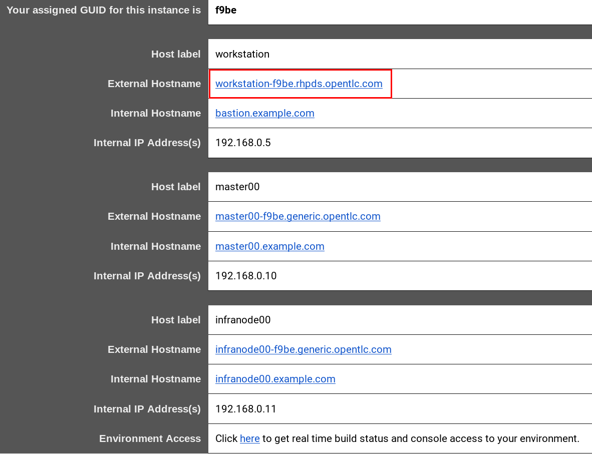

:noaudio:
:scrollbar:
:data-uri:
:toc2:
:linkattrs:

= Lab Setup

.Prerequisites
.. The `ssh` utility installed on your laptop.
+
NOTE: If your network connection is intermittent, consider installing the https://mosh.org/[mosh] utility (`yum install mosh`) as an alternative to the `ssh` utility.

.. Web browser installed on your laptop.
.. Broadband internet connectivity.
.. link:https://account.opentlc.com/account/[Red Hat GPTE _Opentlc_ userId]

:numbered:

== Overview
The target audience for this guide are those Red Hat Solution Architects, Consultants and Red Hat Partners that are interested in using the _Emergency Response_ application to:

. Demonstrate the Red Hat middleware product suite running on OpenShift.
. Provide training on the Red Hat middleware product suite running on OpenShift.

If you are interested in building this demo from its source code, please refer to the link:[TODO] document.

== Lab Virtual Machine

Your lab environment is remote and consists of the following:

. *OpenShift Container Platform* (OCP)  
. link:https://github.com/Emergency-Response-Demo/[Emergency Response Demo]

This lab environment can be accessed via ssh as well as through your local browser.

=== Order Virtual Machine
This section guides you through the procedure to order a virtual machine (VM) for this course.

. In a web browser, navigate to the _Red Hat Partner Demo System_ at:   https://rhpds.redhat.com/catalog/explorer.
. Authenticate using your _OPENTLC_ credentials, for example: `johndoe-redhat.com`.
. Navigate to the following catalog:  `Services -> Catalog -> Catalog Items -> Multi-product Demos`.
. Select the following catalog item: `RHT Emergency Response`.
. Click `Order` on the next page.

. In the subsequent order form, select the check box confirming you understand the runtime and expiration dates. :
. At the bottom of the same page, click `Submit`.

=== Confirmation Emails

Upon ordering the lab environment, you will receive the following two emails:

. *Your lab environment is building*
.. Save this email.
.. This email Includes details of the three VMs that make up your lab application similar to the following:
+

.. Make note of the 4 digit GUID (aka: REGION CODE)
+
* Whenever you see "GUID" or "$GUID" in a command, make sure to replace it with your GUID.

.. Make note of the URL of the `workstation` VM.
+
You will use this when ssh'ing to your application.

.. Make note of the URL of the `master` VM.
+
You will use this when accessing the OCP Web Console.

** The OpenShift master URL varies based on the region where you are located, and may vary from the example shown above.
** For the duration of the course, you navigate to this OpenShift Container Platform master node.

. *VM ready for authentication*
+
Once you receive this second email, wait about another 5 minutes and then you can then ssh into the `workstation` VM of your Ravello application.

=== SSH Access and `oc` utility

SSH access to the remote lab environment provides you with the OpenShift `oc` utility.

. ssh access to your lab environment by specifying your _opentlc userId_ and lab environment $GUID in the following command:
+
-----
$ ssh <opentlc-userId>@workstation-$GUID.rhpds.opentlc.com
-----

. Authenticate into OpenShift as a non cluster admin user (user1) using the `oc` utility
+ 
-----
$ oc login https://master00.example.com -u user1 -p r3dh4t1!
-----
+
NOTE: If you initially receive a HTTP 403 or _no such host_ response, give it a minute or so and try again.

. OCP cluster admin access
+
OCP cluster admin access is provided by switching to the root operating system of your lab environment as follows.
+
-----
$ sudo -i

# oc login -u system:admin      # NOTE: This command is typically not needed
                                #       /root/.kube/config already contains the _system:admin_ user's token
-----

. Provide cluster admin access to OpenShift _user1_:
+
-----
# oc adm policy add-cluster-role-to-user cluster-admin user1
-----

=== Refresh Red Hat SSO state

Your Red Hat SSO needs to be refreshed with valid _redirect_ and _web_origin_ URLs to support your Emergency Response demo.
For this purpose, a script has been provided as follows: 

. SSH into the _workstation_ node of your demo environment as disussed in the previous section.

. As the root operating system user, execute the following exactly as listed:
+
-----
$ sudo -i

mkdir -p $HOME/lab && \
       wget https://raw.githubusercontent.com/gpte-emergency-response-demo/misc/master/erdemo_state_refresh.sh -O $HOME/lab/erdemo_state_refresh.sh \
       && chmod 755 $HOME/lab/erdemo_state_refresh.sh \
       && $HOME/lab/erdemo_state_refresh.sh
-----

. You should see a response similar to the following:
+
-----
will update the following stale guid in RHSSO from: 43b5 to 5dff

UPDATE 3
UPDATE 2

...

deploymentconfig.apps.openshift.io/sso rolled out
deploymentconfig.apps.openshift.io/emergency-console rolled out
-----
+
If you are curious as to what exactly is getting modified in the RH-SSO, you can review link:https://raw.githubusercontent.com/gpte-emergency-response-demo/misc/master/erdemo_state_refresh.sh[the script].
+
In particular, notice that the _redirect_uris_ and _web_origins_  are modified to reflect the actual URL of your Emergency Response lab environment.

. After a couple of minutes, expect your RH-SSO pod to have re-started:
+
-----
$ oc get pods -n sso

keycloak-operator-d894597dc-pkfkc   1/1       Running   1          5h
sso-3-4rg52                         1/1       Running   0          1m
sso-postgresql-1-dn4fl              1/1       Running   1          5h
-----

. Exit out of the root operating system user shell:
+
-----
# exit
-----
+
[blue]#Make sure to exit out of the root shell after every use#

== OpenShift Container Platform

Your lab environment is built on Red Hat's OpenShift Container Platform (OCP).

Access to your OCP resources can be gained via both the `oc` CLI utility and the OCP web console.

=== OCP Web Console

. Point your browser to the URL created by executing the following :
+
-----
$ echo -en "\nhttps://master00-$GUID.generic.opentlc.com\n\n"
-----
+
NOTE:  Substitute `GUID` in the above command with the GUID of your lab environment.

. Authenticate using the following user credentials
.. Username:    user1
.. Password:    r3dh4t1!

== Emergency Response Demo web app

. Point your browser to the URL created by executing the following:
+
-----
$ echo -en "\nhttps://$web_app_url\n\n"
-----
+
image::images/erdemo_home.png[]

. Click the `Register Now` button and fill in the subsequent form.
. Upon registering, click on the _Dashboard_ link from the left panel.
+
image::images/erdemo_auth_home.png[]

ifdef::showscript[]

endif::showscript[]
