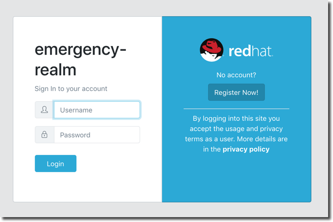
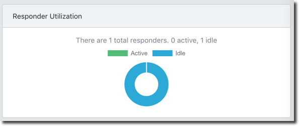
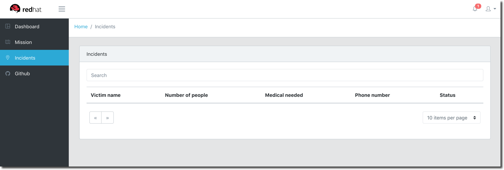
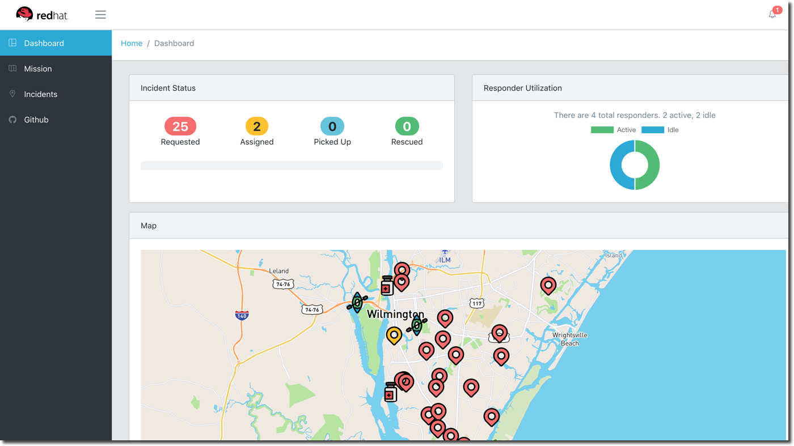
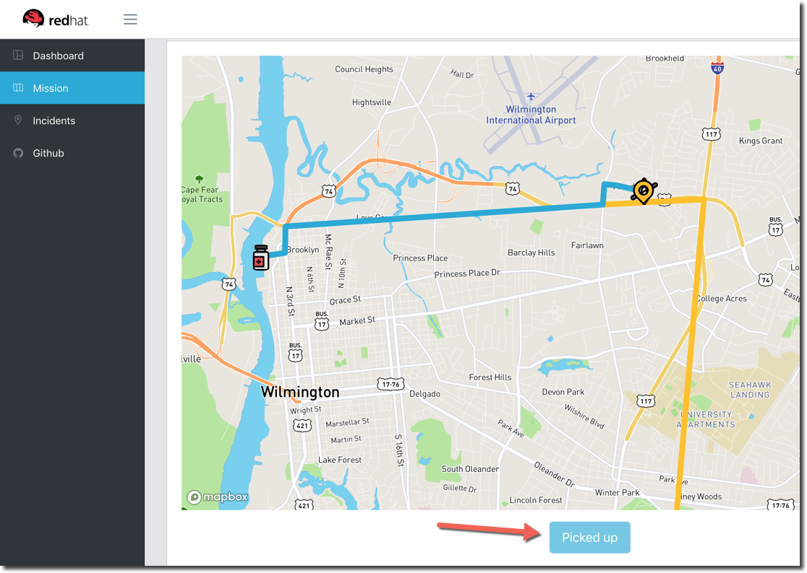

:noaudio:
:scrollbar:
:data-uri:
:toc2: 
:linkattrs:

= Emergency Response Demo: Application Overview

.Goals
* Learn how to demo the Emergency Response Demo Application
* Understand Emergency Response Demo Application Architecture
* Create Incidents and Responders using the Simulator
* Examine the Process Flow for assigning Responders to Incidents
* View Missions in progress with the Dashboard

:numbered:

== Business Case
=== The Problem
In August 2017, Hurricane Harvey caused massive flooding in Southeast Texas, USA. The storm left a number of residents stranded and in need of rescue. Emergency first responders were overwhelmed with the high volume of rescue calls. A loose-knit group of volunteer boaters assisted in the rescue effort. These volunteers explored neighborhoods seeking out residents who needed assistance. In addition, with the support of social media, a group of volunteers served as dispatchers to relay rescue requests to the volunteer boaters. This group of volunteers became known as the https://en.wikipedia.org/wiki/Cajun_Navy[*Cajun Navy*]. The Cajun Navy has been operating in various forms since Hurricane Katrina in 2005.

image::images/volunteer-boaters-stock-photo.png[width="80%"]

=== The Solution
The Emergency Response Demo application is inspired by the Cajun Navy response from Hurricane Harvey. It provides an online solution to connect stranded residents with volunteer responders. This application makes it easy to engage the community to organize volunteer responders.

image::images/dashboard.png[width="80%"]

== Terminology

[cols="1,3",caption="",options="header"]
|====
|Name     | Definition
|Incident           | A request for help from an individual (or group of individuals) that are in need of rescue. Details of an Incident include the location (Lat, Long), the number of people stranded and whether medical assistance is required.
|Responder | A volunteer who has a boat and is willing to rescue people who have reported an Incident.  The boat has a capacity and a flag is set if they can/cannot provide first aid. There are two types of responders. People who sign up online via the emergency console and simulated responders via the Responder Simulator.
|Mission | When a Responder is assigned an Incident, a Mission is created. The Mission defines where the Responder needs to go to collect the victims of the Incident (the Way Point) and what shelter the victims should be dropped off at (the Target Location). The mission also has details of the responders location history.
|====

== Red Hat Technologies

The Emergency Response Demo makes it easy for you to show the power of the integrated Red Hat Middleware Portfolio, running on OpenShift.

Red Hat Technologies used in this application:  

* https://www.redhat.com/en/technologies/cloud-computing/openshift[Red Hat OpenShift]
* https://www.redhat.com/en/technologies/cloud-computing/openshift/application-runtimes[Red Hat OpenShift Application Runtimes (RHOAR)] - Vert.x, Spring Boot and Node.js
* https://www.redhat.com/en/technologies/jboss-middleware/data-grid[Red Hat Data Grid]
* https://www.redhat.com/en/technologies/jboss-middleware/decision-manager[Red Hat Decision Manager]
* https://www.redhat.com/en/technologies/jboss-middleware/process-automation-manager[Red Hat Process Automation Manager]
* https://www.redhat.com/en/technologies/jboss-middleware/fuse[Red Hat Fuse]
* https://www.redhat.com/en/technologies/jboss-middleware/amq[Red Hat AMQ Streams]
* https://www.redhat.com/en/technologies/jboss-middleware/3scale[Red Hat 3scale API Management]
* https://access.redhat.com/products/red-hat-single-sign-on[Red Hat Single Sign-On]

== Application Architecture

In this application, you’ll see Red Hat technologies in action and see how they provide a true hybrid cloud solution, with IT infrastructure that provides consistency, safety, repeatability, reusability, and portability while still helping development teams move fast. The application is based on true polyglot development and it is agile, secure and scalable at every level in the stack.

Below is a diagram of the application architecture.

image::images/application-architecture.png[width="80%"]

== Application Components

The following application components work together to provide the core implementation for the demo solution.

=== Mission Service

* Runtime: Vert.x
* Middleware Products / Components: JDG, AMQ-Streams
* Other Components: None

The Mission Service exposes an API for managing Missions, including getting a list of mission keys, getting a specific mission by key, clearing all missions and getting missions assigned to a specific responder. 

The Mission Service listens on Kafka to the topic-mission-command topic for details of new or updated missions being created. New Mission messages trigger a call to MapBox to generate the routes for a mission, using the responders location as a starting point, the victims location as a way point and the shelter location as the final destination. The mission details are then stored in JDG, to service API requests for Mission details.

The Mission Service sends updates to Kafka on the topic-mission-event topic in response to mission state change events such as when a mission is created, when an API request is received (e.g. to complete all missions). The Mission service also sends updates to Kafka on the topic-responder-command when missions are completed to indicate that the Responder is available for a new mission.

.Kafka Topics
* Send: topic-mission-event, topic-responder-command
* Receive: topic-mission-command, topic-responder-location-update

=== Process Service

* Runtime: Spring Boot 
* Middleware Components: 
** Process Automation Manager (PAM)
** Decision Manager (DM)
* Other Components: Postgres DB

The Process Service is responsible for managing the overall process flow of the system. The Process Service operates purely on Kafka messages and does not expose any HTTP API - although it does invoke HTTP APIs in the Responder and Incident Priority Services. 

When a new Incident is reported on the topic-incident-event Topic, the process Service kicks off a new BPM process to manage the new Incident. When a Responder is shown as available (via the topic-responder-event Topic), the BPM process is updated to reflect this. As the Mission progresses and additional messages are received on the topic-mission-event Topic, the BPM process is updated to reflect the latest state.

The Process Service sends out multiple types of messages on various Topics in response to the Incident progressing through the Business Process.

.Kafka Topics
* Send: topic-mission-command, topic-responder-command, topic-incident-command, topic-incident-event
* Receive: topic-incident-event, topic-responder-event, topic-mission-event

=== Incident Service

* Runtime: Spring Boot
* Middleware Products / Components: AMQ-Streams
* Other Components: Postgres DB

The Incident Service exposes an API for registering new Incidents and retrieving information about existing Incidents. An endpoint is also exposed for resetting Incident state (this is typically used by simulator services for managing and resetting the demo).

When a new Incident is received, the Incident details are stored in the database and a new message is sent out on the topic-incident-event Kafka Topic.

The Service also listens on Kafka to the topic topic-incident-command for updates to Incidents and stores the latest Incident state in the Database.  

.Kafka Topics
* Send: topic-incident-event
* Listen: topic-incident-command

=== Responder Service

* Runtime: Spring Boot
* Middleware Products / Components: AMQ-Streams
* Other Components: Postgres DB

The Responder Service exposes an API for managing Responders, including registering new Responders, retrieving information about all available responders and retrieving information about specific responders. Endpoints are also exposed for removing responders and resetting responder state (these are typically used by simulator services for managing and resetting the demo).

When a new Responder is registered, the Responder details are stored in the database.

The Service also listens on Kafka to the topic test-topic for updates to Responders and stores the latest Responder state in the Database. If the update to the responder includes an Incident Id (i.e. if the responder has been assigned to work on an Incident) the services also sends a new Kafka message to the topic test-topic.

.Kafka Topics
* Send: test-topic
* Listen: test-topic

=== Emergency Web Console

* Runtime: Node.js, Angular
* Middleware Products / Components: None

The emergency console is the front end UI for the Demo Solution. It provides the following main views:

* Incident Commander Dashboard: The overall view of all Incidents, Responders and Missions
* Responder Interface: The view for an individual responder which shows their current mission, including the router to the Incident and onward route to the shelter   
* Incidents: A tabular list of all incidents

The console communicates with several of the back end services (Incident, Mission & Responder) to display real time data via WebSockets.

== Demo Simulators

The following components are used to control the demo and simulate events which are needed for the demo, but which can not be sourced from / represented in the real world (i.e. Incidents, Responder Bots, Responder movement around the map).

=== Responder Simulator

* Runtime: Vert.x 
* Middleware Components: None
* Other Components: None

The Responder Simulator is responsible for moving responders (both bots and humans) around the map during missions. As the demo requires the movement of personnel to function and since we can not have real people actually moving many miles for each Mission, this simulator is required to allow the demo to function.

The Responder simulator listens on the topic-mission-event for details of active responders that need to be moved on the map. The simulator them periodically updates (default every 10 seconds) the responders location (based on the mission route received) to show the responder at the next location. As the simulator moves responders, it emits messages on the topic-responder-location-update Topic.

.Kafka Topics
* Send: topic-mission-event
* Receive: topic-responder-location-update

=== Disaster Simulator

* Runtime: Vert.x 
* Middleware Components: None
* Other Components: None

The Disaster Simulator is used for managing / coordinating the demo. It exposes a basic UI which allows a user to add and remove Incidents and Responders in order to drive the demo forward. 

image::images/create-incidents.png[width="80%"]

The Disaster Simulator uses HTTP API requests to the Incident Service, the Responder Service the Mission Service and the Incident Priority Service in order to manage data creation / deletion.

== View the Emergency Response Demo Web Console

To get started with the Emergency Response Demo, you need the URL to the demo. You can access the URL from the OpenShift Web Console. Follow the steps below.

. In your terminal window, display the OpenShift Admin Web console
+
----
$ echo $OCP_CONSOLE_URL
----

. Start a web browser and visit the URL for `$OCP_CONSOLE_URL`

. On the OpenShift login page, enter the following credentials:
.. Username: `user1`
.. Password: `r3dh4t1!`

. Once logged in, select the project *emergency-response-demo*

. In the list of applications, click the link for *emergency-console*
+
image::images/launch-emergency-console.png[width="80%"]

. This link takes you to the login screen for the Emergency Web Console
+

. Click the *Register Now!* button. This is for registering as a volunteer responder.

. Enter the relevant information for your account. You can select any test data.
.. Make note of the fields for Boat Capacity and Medical Support. 
.. You can specify how many people you can carry in your boat. Also, you can indicate if you provide medical / first-aid support.
+
image::images/register-now-responder.png[width="80%"]

. Click *Register*

== Explore the Application

Once you are successfully registered, you will see the main application screen.

image::images/main-application-screen.png[width="80%"]

* This screen has the following links:

** *Dashboard*: The overall view of all Incidents, Responders and Missions
** *Mission*: The view for an individual responder which shows their current mission, including the router to the Incident and onward route to the shelter 
** *Incidents*: A list of all incidents
** *Github*: Link to the Github repo

=== Dashboard

. Select the link for *Dashboard*

** This screen shows an overall view of all Incidents, Responders and Missions. At the moment the screen is empty, but in the following sections we will add data to the application.
+
image::images/dashboard-empty.png[width="80%"]

==== Incident Status
The Incident Status section tracks the data for number of incidents requested, assigned, picked up and rescued. These values update in real-time based on application events.

==== Responder Utilization
The Responder Utilization section monitors the total number of responders, active and idle responders. This section is also updated in real-time based on application events.

==== Map
The map shows the location of the incidents, responders and their associated routes. 

=== Mission

When a Responder is assigned an Incident, a Mission is created. The Mission defines where the Responder needs to go to collect the victims of the Incident (the Way Point) and what shelter the victims should be dropped off at (the Target Location). The mission also has details of the responders location history.

. Select the link for *Dashboard*

** This screen shows the view for an individual responder which shows their current mission, including the router to the Incident and onward route to the shelter.

. Add yourself to the map as a responder
.. Click any location on the map.
+
image::images/add-as-responder-to-the-map.png[width="80%"]

.. Click your boat icon. It will show the details of your boat profile.
+
image::images/responder-boat-details.png[width="80%"]

.. Click the *Available* button.
** You are now registered as an *Available* responder.

. Click the *Dashboard* link
** In the *Responder Utilization* section, verify that there are 1 total responders. This is based on your recent action.
+

=== Incidents

An incident is a request for help from an individual (or group of individuals) that are in need of rescue. Details of an Incident include the location (Lat, Long), the number of people stranded and whether medical assistance is required.

. Click the *Incidents* link

** This screen shows a list of incidents. At the moment, this screen is empty, but we will create incidents in the next section.
+

== Disaster Simulator

. Move back to the *OpenShift Web Console* window

. In the list of applications, click the link for *disaster-simulator*
+
image::images/launch-disaster-simulator.png[width="80%"]

. This takes you to the Disaster Simulator web console.

=== Create Incidents

. In the section for *Create Incidents*, move to the field for *Number of Incidents* and enter `50`.
. Click *Submit*
+
image::images/create-incidents.png[width="60%"]

=== Create Responders
. In the section for *Create Responders*, move to the field for *Number of Responders* and enter `3`.
. Click *Submit*
+
image::images/create-responders.png[width="60%"]

. Move back to the *Emergency Response Demo Web Console* window

. Click the *Dashboard* link.

. Confirm that you have incidents and responders. 

** You will see activity as the responders are assigned to missions. The responders will start moving to rescue the stranded victims.
+

== View Your Mission

By this time, your boat should have been assigned to a mission.

. Click the *Mission* link.

* You will see your boat moving towards an incident.

* Once your boat makes it to the incident location, click the *Picked Up* button.

* This confirms that you have picked up the passengers and your boat will proceed to the shelter.
+

== View Incidents

You can view a list of all incidents and check their status.

. Click the *Incidents* link.
+
image::images/view-all-incidents.png[width="80%"]

== Process Automation

The Process Service is responsible for managing the overall process flow of the system. The Process Service operates purely on Kafka messages and does not expose any HTTP API - although it does invoke HTTP APIs in the Responder and Incident Priority Services. 

When a new Incident is reported on the topic-incident-event Topic, the process Service kicks off a new BPM process to manage the new Incident. When a Responder is shown as available (via the topic-responder-event Topic), the BPM process is updated to reflect this. As the Mission progresses and additional messages are received on the topic-mission-event Topic, the BPM process is updated to reflect the latest state.

The Process Service sends out multiple types of messages on various Topics in response to the Incident progressing through the Business Process.

Let's view the process diagram for an incident.

. Click the *Dashboard* link.

. Click an Incident on the map.
** This will show a pop-up for the incident.
+
image::images/incident-popup.png[width="80%"]

. Click the link for *Process Diagram*
** This will open new tab to view the Process Diagram for this incident.
+
image::images/view-process-diagram.png[width="80%"]

. Review the process diagram for this incident.

== Clean Up

Let's clean up our application by clearing the incidents, responders and missions.

. Move back to the *Disaster Simulator* web console.

. Click the buttons to clear application data
.. Click *Clear incidents*
.. Click *Clear responders*
.. Click *Clear missions*
+
image::images/clear-incidents-responders-missions.png[width="60%"]

. Move back to the *Emergency Response Demo Web Console* window

. Click the *Dashboard* link.

. Confirm that all of application data is cleared. 

Congratulations! You have completed this lab. Please move on to the next lab.

