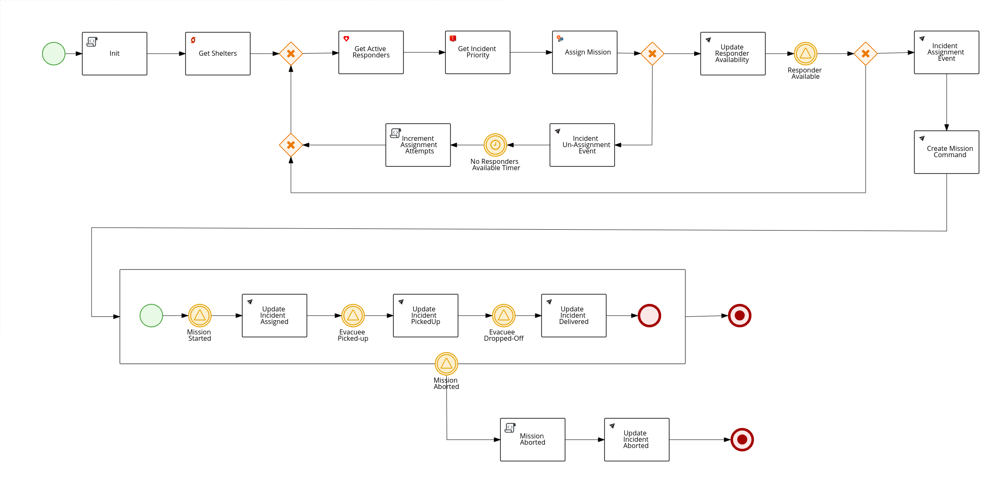
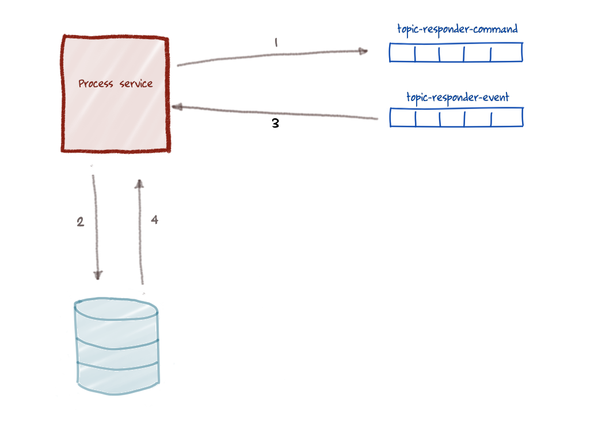
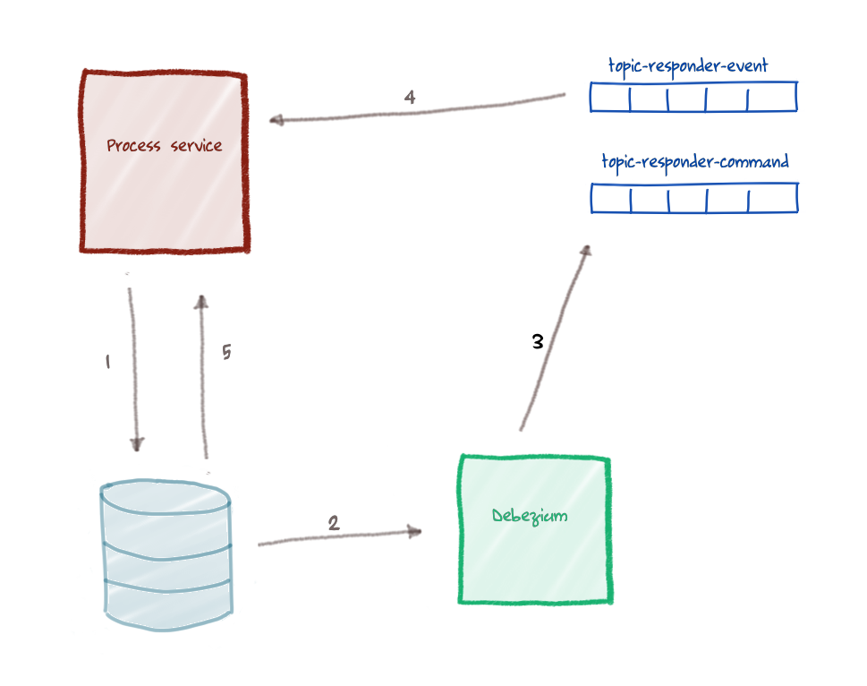

# 1. *Happy Path* Business Processes

The Emergency Response demo is an event-driven architected application using Red Hat AMQ Streams (aka: Apache Kafka) on OpenShift Container Platform.  Red Hat Process Automation Manager (RH-PAM) is also used to orchestrate the message-driven interactions between all of the services of the application.  The BPMN2 business process model (named: [incident-process.bpmn](https://github.com/Emergency-Response-Demo/incident-process-kjar/blob/master/src/main/resources/com/redhat/cajun/navy/process/incident-process.bpmn)) that represents this orchestration at runtime is as follows:



This business process, when viewed in its end-to-end entirety, can be classified as *asynchronous*. This is because the business process defines *wait-states* that decouple execution of its various tasks from one another.  This asynchronous business process paradigm is best discussed in the seminal article: [Your Starbucks Coffee Shop Does Not Use Two-Phase Commit](https://martinfowler.com/ieeeSoftware/coffeeShop.pdf).

However, between these wait-states, the business process executes *synchronously* using a transaction.  This synchronous sequence of steps is depicted in detail as follows:




1. A transaction is started, the process service retrieves the state of a process instance from the database and executes a series of tasks.  In the ER-Demo *incident-process*, one of these tasks is a *workitem* that sends a Kafka message to the `topic-responder-command` topic of AMQ Streams. (related: the ER-Demo *responder-service* consumes and processes this message from that topic).
2. Within this same transaction, the process instance reaches a signal node (which is a *wait-state*) and this transaction is committed (along with the state of the process instance at that time) to the RH-PAM database: PostgreSQL.  So within this single syncronous transaction there are two writes:  a write to a Kafka topic and a write to the RH-PAM PostgreSQL database.
3. The ER-Demo *responder-service* responds back to the process service via the `topic-responder-event` topic.
4. The process service consumes the message on the `topic-responder-event` topic and in a new transaction pulls the process instance state from the database and executes downstream work until the next *wait-state* in the business process is reached.

So to recap, the ER-Demo business process is asynchronous when viewed in its entirety but is synchronous when executing between wait-states.  Under idealistic circumstances this approach generally works fine.


# 2. Pitfalls of Dual-Writes 

In the ER-Demo application, even though the use of synchronous transactions is isolated to execution between wait-states and these transactions tend to be short lived (ie:  ~ 10 millis), problems still occur.

In particular, what has been observed is that in some cases during these synchronous transactions, the delivery, processing and reply of Kafka messages(steps 1 & 3) completes **before** the process instance flush to the PostgreSQL database (Step 2).  When this occurs, the process instance is not yet waiting for the next signal (to initiate the next synchronous transaction), and subsequently the signal is lost. The process instance does not resume execution and `hangs` at the signal node.

This problem most often occurs during execution of the *Update Responder Availability* task of the ER-Demo's *incident-process*:


# 3. *Outbox Pattern* to the Rescue

To some degree, this problem could be resolved if [AMQ Streams / Apache Kafka supported XA transactions](https://gps2nowhere.wordpress.com/2019/09/22/xa-transactions-2-phase-commit-in-kafka/) (aka: Two-Phase Commit (2PC) ).  Even then, however, 2PC introduces its own slew of unintended consequences and considerations.

To resolve the problem of *dual-writes in a single transaction* experienced in the ER-Demo application, the *outbox pattern* has been implemented using technology from the Red Hat sponsored [Debezium open-source project](https://debezium.io/) .  The approach taken is best discussed in [this blog post](https://debezium.io/blog/2019/02/19/reliable-microservices-data-exchange-with-the-outbox-pattern/).

Using the *outbox pattern*, the problem of dual-writes is resolved in the ER-Demo application via the following series of steps:





1. Process execution hits the signal node: process instance state **and** an *outbox event* are persisted to the same database as part of a transaction commit.  Unlike the original architecture, there is now only this single write in this transaction. The *outbox event* contains the message payload to be sent to the `topic-responder-command`. This *outbox event* is persisted in an *outbox table* (which is co-located in the same database as the RH-PAM process engine tables). 
2. Debezium scans the transaction log of the database and picks up the insert in the outbox table.  The record to the outbox table is deleted immediately after creation and Debezium ignores the delete logs from Postgres.
This immediate deletion of the record is to ensure that the outbox table does not grow endlessly.

3. Debezium sends the outbox event to the `topic-responder-command`
4. The process service consumes the reply message originating from the *responder-service* and signals the embedded process engine.
5. The process engine loads the process instance from the database in a new transaction.


With the outbox pattern, the message to the `topic-responder-command` is only sent after the transaction is committed to the database. It is no longer the process service that sends the message. Rather the message payload is persisted together with the process state, and Debezium picks up the change event in the database and sends the message to the `topic-responder-command` topic.


# 4. GIVE ME THE DETAILS !!!!

Details about the implementation of the *outbox pattern* in the ER-Demo application are as follows:

1. Debezium requires use of a PostgreSQL 10 database that [includes a *decoding output plugin*](https://debezium.io/documentation/reference/1.2/connectors/postgresql.html).  This *decoding output pluting* extracts changes committed to the PostgreSQL transaction log.  In the ER-Demo application, the RH-PAM process engine embedded in the *process-service* leverages a PostgreSQL 10 database that includes this *decoding output plugins*:
   ```
   $ ERDEMO_NS=user1-er-demo    # CHANGE ME (if needed)

   $ oc get dc process-service-postgresql \
       -n $ERDEMO_NS \
       -o=jsonpath='{.spec.template.spec.containers[].image}'

   quay.io/emergencyresponsedemo/postgres-10-decoderbufs-fedora

   ```

2.  Debezium builds upon the [Kafka Connect](https://kafka.apache.org/documentation/#connect) project.  As such, implementation of the outbox pattern in the ER-Demo, requires a *Kafka Connect* deployment (provided by Red Hat AMQ Streams).  This deployment can be viewed as follows:

    ```
    $ oc get kafkaconnect.kafka.strimzi.io -n $ERDEMO_NS
    NAME            DESIRED REPLICAS
    kafka-connect   1


    $ oc get deployment kafka-connect-connect -n ERDEMO_NS
    NAME                    READY   UP-TO-DATE   AVAILABLE   AGE
    kafka-connect-connect   1/1     1            1           2d2h


    $ oc get deployment kafka-connect-connect -n $ERDEMO_NS \
         -o=jsonpath='{.spec.template.spec.containers[].image}'

    quay.io/emergencyresponsedemo/strimzi-debezium-postgresql:1.4.0-1.1.2.Final

    ```

    The image used in the Kafka Connect contains the Java code which reads the changes produced by the PostgreSQL *decoding output plug-in*.


3. Debezium pulls configuration information about the database it is to scan from a *kafkaconnector* (provided by Red Hat AMQ Streams) (NOTE: the following command makes use of the [jq](https://stedolan.github.io/jq/) library):
  
    ```
    $ oc get kafkaconnector.kafka.strimzi.io \
        debezium-postgres-process-service \
        -o json -n $ERDEMO_NS | jq .spec

    {
      "class": "io.debezium.connector.postgresql.PostgresConnector",
      "config": {
        "database.dbname": "rhpam",
        "database.hostname": "process-service-postgresql.user10-er-demo.svc",
        "database.password": "PiqOKMyDWWYv",
        "database.port": "5432",
        "database.server.name": "rhpam1",
        "database.user": "postgres",
        "schema.whitelist": "public",
        "table.whitelist": "public.process_service_outbox",
        "tombstones.on.delete": "false",
        "transforms": "router",
        "transforms.router.route.topic.replacement": "topic-${routedByValue}",
        "transforms.router.table.fields.additional.placement": "type:header:eventType",
        "transforms.router.type": "io.debezium.transforms.outbox.EventRouter"
      },
      "tasksMax": 1
    }
    ```

4. The same Debezium configuration information can be pulled directly from Debezium's RESTful API:

      ```
      $ oc rsh `oc get pod -n $ERDEMO_NS \ 
           | grep "^process-service-postgresql" \ 
           | grep "Running" | awk '{print $1}'`

  
      $ curl kafka-connect-connect-api:8083/connectors/debezium-postgres-process-service

      ```


5. The *outbox* table that stores the json message to be delivered by Debezium to the *topic-responder-command* topic resides in the *rhpam* database and can be viewed as follows:

    ```
    $ oc rsh `oc get pod -n $ERDEMO_NS \ 
        | grep "^process-service-postgresql" \ 
        | grep "Running" | awk '{print $1}'`
    

    $ psql rhpam
    

    rhpam=# \d process_service_outbox

    Column         |          Type          | Collation | Nullable | 
    ---------------+------------------------+-----------+----------+
     id            | uuid                   |           | not null | 
     aggregatetype | character varying(255) |           | not null | 
     aggregateid   | character varying(255) |           | not null | 
     type          | character varying(255) |           | not null | 
     payload       | text                   |           |          | 
    Indexes:
        "process_service_outbox_pkey" PRIMARY KEY, btree (id)
    

    rhpam=# select * from process_service_outbox;

    0
    
    ```

    Notice that (as expected) there are zero records in the table due to the immediate deletion of records to this table.


6. The code that writes to the *process_service_outbox* table when sending a message to the ER-Demo *responder service* is implemented in a [custom RH-PAM workItemHandler](https://github.com/Emergency-Response-Demo/process-service/blob/process-service-outbox/src/main/java/com/redhat/cajun/navy/process/wih/KafkaMessageSenderWorkItemHandler.java#L78-L85) :
   
   ```
   if (updateResponderCommandDestination.equals(destination)) {
            OutboxEvent outboxEvent = null;
            try {
                outboxEvent = new OutboxEvent("responder-command", key, msg.getMessageType(), new ObjectMapper().writeValueAsString(msg));
            } catch (JsonProcessingException e) {
                throw new RuntimeException(e);
            }
            outboxEventEmmitter.emitEvent(outboxEvent);
   }

   ```

7. The code that inserts and then immediately deletes the record in the *process_service_outbox* table is [here](https://github.com/Emergency-Response-Demo/process-service/blob/process-service-outbox/src/main/java/com/redhat/cajun/navy/process/entity/OutboxEventEmitter.java#L16) :
   
   ```
   @Component
   public class OutboxEventEmitter {

    @PersistenceContext
    private EntityManager entityManager;

    public void emitEvent(OutboxEvent event) {
        entityManager.persist(event);
        entityManager.remove(event);  // Remove immediately upon creation
    }

   }
   ```
    
# 5. Conclusion

The Red Hat sponsored Debezium community project provides powerful capabilities to be employed in modern *cloud-native* architected business applications.

By leveraging Debezium to implement the *outbox pattern*, the ER-Demo greatly benefits by executing a single write in *Update Responder Availability* transaction.  
It now completely avoids all unintended consequences of *dual writes* in that synchronous transaction.

The *outbox pattern* is just one of many use-cases to employ Debezium.  
We encourage you to familiarize yourself with its [capabilities and usecases](https://speakerdeck.com/gunnarmorling/practical-change-data-streaming-use-cases-with-apache-kafka-and-debezium-qcon-san-francisco-2019) to employ it in your *cloud-native* architectured business applications.
    
    
